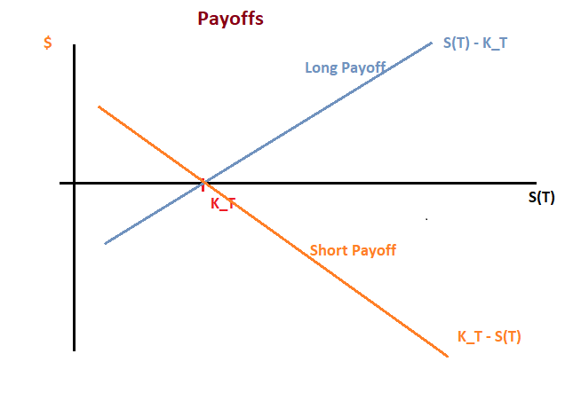

Forward Payoffs
- For a derivatibe contract, generally, we refer to the revenue a particular counter party earns from their position in it as the derivative's payoff.
- For a future contracts, neither the long nor the short receive any payment from the contract until its expiration.
- At expiration, the payoff to either party equals the value of the forward contract to them. That is, the value of either the long or the short position in the forward contract at expiration equals the long or the short payoff respectively.
- All value in a forward contract derives from its payoff (to either party) at expiration.

## Notation for Forward Contracts:
  - S(t) = price of the underlying asset at time _t_
  -  = forward price for expiry 
  - _T_ = expiration date
  - _r_ = risk free rate
  - _V(t)_ = value of long forward position at time _t_
  - _V(T)_ = long forward payoff

## Cash flows:
- At expiration the underlying is transferred to the long from the short. So the long receives an asset worth , a  "cash flow" in essence.
- But the long must pay the short the forward price , which must be deducted from the value received.

- The long forward payoff is

 
  

- the payoff to the short is

