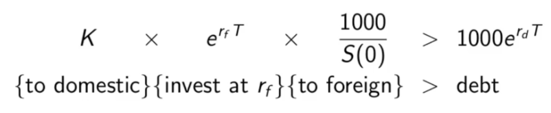

# Foreign Exchange Forwards
- Biggest market in forwards
- A forward on a foreign currency (sometimes known as FX forward) is then a contract that locks in a particular exchange rate for the expiration date of the contract.
- Our notation for interest rates when working with a foreign curency: the risk free rate in the foreign currenc is denoted by  and we denote the risk free rate in our home currency by  (normally denoted just by _r_).
- We always assume that a holding of a foreign currency is invested at the rate . We may thus regard holdings of foreign currency as an income paying asset with a known yield. In the notation we have been using, 
- We may thus apply the theory we have developed for income bearing assets with a known yield to the case of FX forwards.
- Let _S(t)_ be the spot exchange rate at time _t_ which is the price in domestic currency of 1 unit of foreign currency,
-  is the forward price, the forward exchange rate or just the forward rate.
- With this notation our previous expression for the forward rate is (below) for a contract expiring at time _T_.

- In foreign currency economics the forward price formula has been known, independently of the theory of derivatives, and is called the interest rate parity relationship. We will here consider the traditional arguement for deriving it.
- Suppose you were offered a forward rate _K_ where 
  - Rewrite this inequality

  - Choose some notional amount, say $1000. Multiply this inequality by this value:

  - Interpretation: the right hand side is the value at _T_ of a debt of $1000 borrowed at _t_=0.
  - Left hand side: The factor 1000/_S(0)_ converts $1000 to foreign currency at _t_ =0 .
  - The second factor  pushes it forward to time _T_ at the foreign risk free rate.
  - The third factor _K_ converts that future value back to domestic at the future rate locked in now.
  - The inequality applies that if we enter the contract as the seller we can:
    - borrow $1000 (or any amount) at the domestic risk free rate;
    - convert the cash to foreign currency;
    - invest at the foreign risk free rate,
    - at expiration convert back to domestic under the contracted rate and be assured our investment is more than our debt.
  - The difference is an arbitrage profit.

- Suppose you were offered a forward rate _K_ where 
  - Rewrite this inequality

  - then we can construct an arbitrage by:
    - borrow $1000 (or any amount) in foreign currency;
    - convert the cash to domestic currency;
    - invest at the domestic risk free rate,
    - at expiration convert back to foreign under the contracted rate and be assured our investment is more than our debt.
  - The difference is an arbitrage profit.

- In summary, both inequalities lead to an arbitrage, and thus both can be ruled out. We have revalidated the formula for the fair forward rate in a FX forward.

__Remakrs:__ The arbitrages employed in this lecture are simply versions of cash and carry arbitrages. What is different is that it can be regarded as a cash and carry arbitrage in both directions. This is due to the symmetry of the circumstance: the "reverse" cash and carry arbitrage in the home currency is just a cash and carry arbitrage from the point of view of foreign currency.

# Examples

## Example 1:
Suppose the spot Euro/USD exchange rate is $1.20/Euro. Suppose the domestic USD risk free rate is 5% and the Eurozone risk free rate is 8%. What is the forward exchange rate for a 6 month FX forward contract on the Euro/USD currency pair? If you were offered a forward rate of $1.21/Euro how would you take advantage of it? What if the offered rate were $1.15/Euro?

We have:
- Current spot rate is _S(0)_ = 1.20
- Domestic risk free rate: 
- Foreign risk free rate: 
- Expiration date: _T_ = 6 months =0.5
- The forward rate is then

__Hypothetical case 1:__ Offered forward rate of $1.21/Euro. We have $1.21 > $1.1812 (forward rate). Offered rate is higher than actual forward rate. To lock in an arbitrage profit, we borrow in USD and invest in Euro. 
- Borrow USD $1000, convert it to Euros at the prevailing spot rate _S(0)_ =1.20/Euro. In Euros we have

- This will be invested at the foreign risk free rate of  for 6 months. The future value of this investment is

- We enter the forward contract to sell 867.34 Euros at the offered rate of $1.21/Euro in 6 months.
- Converting our investment back to USD at this rate gives

- The value of our USD debt in 6 months is

- After paying our debt we are left with a profit of 

## Example 2:
Suppose you own a US based import/export company and expect to be buying a large shipment in 2 months from Australia. You will be making a payment of AUD 10,000,000 at that time. Suppose the current spot exchange rate for AUD/USD is $0.75/AUD. Suppose the deomestic risk free rate is 4% and the risk free rate in Australia is 6%. How would you use FX forwards to protect yourself from FX risk? What is the forward rate for a 2 month AUD/USD contract? What would be the value of the forward protecting the entire payment in 1 month if at the time the exhange rare is $0.71/USD

### Case 1
We have:
- Current spot rate is _S(0)_ = 0.75
- Domestic risk free rate: 
- Foreign risk free rate: 
- Expiration date: _T_ = 2 months =2/12
- The forward rate is then

### Case 2
- The value of the forward contract at any time _t_ (for 1 unit of foreign currency) is

- For _T_=1 month, assuming S(1/12) = 0.71/AUD

- =value of  a forward on 1 Australian dollar.
- A forward contract on 10 million AUD is equivalent to 10 million contracts on 1AUD, so the value of the required forward at 1 month is

