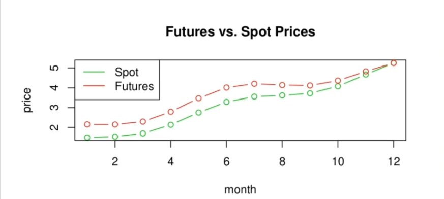

# Futures Prices and Spot Prices
- The central distrinction between forward contracts and futures contracts:
  - The long positionin a forward contract is the right, and obligation, to receive at the expiration date _S(T) - K_. "Obligation" emphasizes that, in the case where this payoff is negative, the long is obligated to pay. Thus the forward payoff may be regarded as a cashflow at expiry, with the implication that if it is negative, the long position holder must pay.
  - The long position in a futures contract is the right, and obligation, to receive the stream of cashflows on each successive day during the contract's life.

 
   
   
   

  - Since the vast majority of futures contracts are terminated before delivery, a futures positionis in effect a contract to receive, or pay, this sequence of daily cash flows, though one which can be terminated at any time.
  - This is mpt tje same thing as a forward where no money changes hands until expiry when the transaction takes place at the contracted forward price.
  - The cash and carry and replication arguements used to derive the forward price and forward contract value are invalid for marked to market futures positions.
  - Thus the results for forward prices and contract values do not, in principle, hold for futures.

- In practice, futures prices are close to forward prices in most markets. There are theoretical arguements that futures prices agree closely with forward prices under realistic assumptions.For example, if interest rates are constant, or uncorrelated with the underlying price, theoretical arbitrage arguements imply that forward and futures prices agree. Secondly, it is observed empirically that futures prices track spot prices in a manner consistent with relations of the form (where _c_ is the applicable cost of carry)

__Remark:__ Relation (1) is an arbitrage relation not a statement of cause and effect. It does not mean that the spot price determines the futures price. It may be that forward prices are what drive the spot prices. This prevailing view for commodity markets.

### Convergence between Spot and Future Price

- If the 2 prices deivate too far from it, arbitrage activity will bring them in alignment.
- There is one further property of futures prices, a special case of (1). It is justified by an independent arbitrage arguement which is valid for futures contracts. As _t_ approaches the expiration date, the futures and spot prices come together. 
- The futures price must converge to the spot price as the expiration date is approached. During the delivery month, the futures price must equal (or be very close to) the spot price, Mathematically: 

- __Case 1:__ Suppose during the expiration month that

- An arbitrage can be realized by:

  - taking the short position in the futures contract.
  - purchasing the underlying
  - immediately making delivery
  - These actions realize an arbitrage profit of

- __Case 2:__ Suppose during the expiration month that

- An arbitrage can be realized by:

  - taking the long position in the futures contract.
  - purchasing the underlying at the futures price at delivery
  - immediately selling underlying on the spot market
  - These actions realize an arbitrage profit of

- So at the expiration date of the contract we have 
- Then for times _t < T_ we expect that as _t_ approached _T_ that  and _S(t)_ should approach each other. This is approximately what is observed in markets. In general, there are deviations from it in different local cash markets. This is what is meant by futures basis.

## Summary:
The futures price is linked to the spot price.
- The arbitrage relation can be expected to hold, to some approximate degree, in most markets.

- The convergence of futures to spot holds to within the basis

- __Remark:__ Note the critical role the delivery process for these results.
