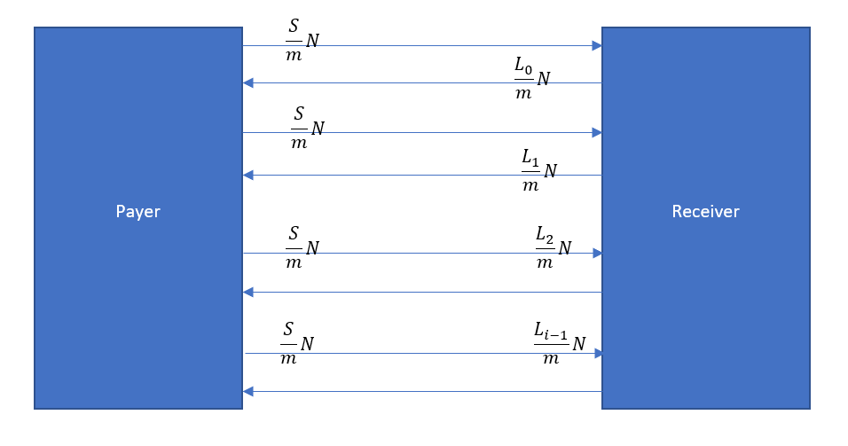

# Swaps
Swaps are derivatives with 2 counterparties in which the 2 counterparties agree to exchange cash flows with each other.
__Interest Rate Swaps:__ In an interest rate swap a fixed interest payment, on some notational value, is exchanged for a floating interest payment on the same notional value.
__Currency Swaps:__ In a currency swap an interest payment in one currency is exchanged for an interest rate in another currency. 
__Other Swap Types:__ In an __Equiy swap__ a fixed payment is exchanged for the return on some stock or stock index. __Commodity swaps__ exchange a fixed payment for a payment related to a commodity price.
The swap market has, historically been an OTC market. Linke other OTC products, we can divide the participants in swap markets into these classes: dealers (investment banks, broker/dealers, etc.) and end users (nonfinancial business and individuals). As OTC products counterparty credit risk has been a major concern for swaps. The swap market is changing: since the 2008 financial crisis, there has been a global regulatory effort to move standardized swaps into a more exchange traded environments. 2 examples:
- Many swaps are now centrally cleared.
- A significant fraction of swap trading now take splace on _ swap execution facilities_.

## Interest Rate Swaps
__Interest Rate Swaps__ are swaps by far the most prevalent swap contract, with the great majority of outstanding notional in swaps attributable to interest rate swaps. In an interest rate swap a floating interest payment (e.g. a LIBOR rate) is paid by one party to the other, who in turn pays the first party an interest rate fixed at contract origination. We distinguish the counterparties b referring to the party paying the fixed rate as the __payer__ and the party paying the floating rate (and thus receiving the fixed rate) as the __receiver.__ 
When an interest rate swap is originated, a notaional value is contracted, representing the principal that interest payments will be based on (Even though no principal is ever exchanged between the counterparties).
- Denote the notional value by _N_.
- The contract specifies a series of payment dates  usually spaced by 3 month of 6 month increments.
- In addittion  denotes the contract origination date.
- A particular fixed interest rate is contracted, which we denote by _S_. _S_ is called the swap rate.
- A particular market interest rate is chosen for the floating payment. Denote this floating interest rate level  for the value of the floating rate set on date . __NOTE:__  is not the floating rate paid on date 

Let _m_ be the number of payments per year. Usually, _m_=2, or 4, for semiannual or quarterly payments. The floating rate  is usually 3 month LIBOR (if m=4) or 6 month LIBOR (m=2). The compounding convention for LIBOR rates, as well as the fixed swap rate, is __simply compounding__, which is similar to periodic compounding. 
With simple compounding if _L_ is the interest rate charged over a loan term  on a notaional value _N_ we have

This is how the first interest charge is calculated in periodic compounding if  = a compounding period. In simple compounding, no compounding ever takes place because the loan term is 1 compounding period.

The LIBOR rate  is the interest rate set on date , charged to borrow money from date  to date . The interest charged on principal _N_ is

and it is paid on date 
Both the fixed and floating interest rates in a swap are applied in the same way. So on date , the payer pays to the receiver

and the receiver pays to the payer

__Remarks:__ LIBOR is in the process of being phased out and replaced. Eventually other floating interest rates will replace LIBOR in swaps. This is a transition in progress right now.

### Example:
Suppose 2 companies, A and B, enter a 5 year swap contract as counterparties, on June 15 2017 with A the payer and B the receiver. Suppose the contracted notional is $10,000,000 and the swap rate (the fixed interest rate) is 3%. Suppose the payments are semiannual, and the floating interest rate is 6 month LIBOR. What are the first 2 cash flows in the swap.
Suppose the 6 month LIBOR rate is 2.8% on June 15. 6 months later on December 15, 2017 the first payments are due.
A, the payer, pays to B

and B, receiver, pays to A

resulting in a net payment of $10,000 from A to B.

Suppose also on December 15 2017 that 6 month LIBOR is 3.1%. Then 6 months later, on June 15, 2018, A pays to B

as before (payer pays the same amount each cycle) and B pays to A

for a net payment of $5000 from B to A. This cycle continues, every 6 months, for 5 years of the contract's life.

Swaps have a variety of risk management uses. Interest rate swaps are for many applications the ideal tool for managing interest rate risk. One major application is to control the interest rate risk on loans. Banks prefer to charge floating rates on their loans (because their own funding is usually at floating rates). Bank customers are thus exposed to interest rate risks on their loans. They can manage that risk by using swaps to convert the loans to fixed rates. Swaps can be used in more sophisticated ways also, such as adjusting the exposures (Durations) of bond portfolios.
