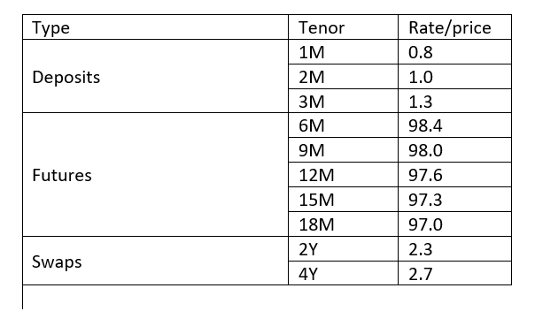
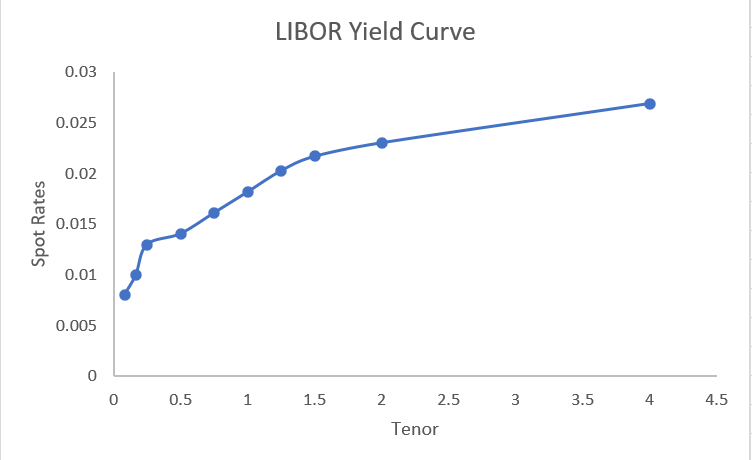

# Building a LIBOR Curve
Bootstrapping a LIBOR curve. LIBOR curve is a spot rate curve based on inputs from money market instruments. 
- We use cash LIBOR rates for tenors up to 3 months. We may compute discount factors directly from these rates and from the discount factors can compute the spot rates.
- For tenors between 3 months and about 2 to 5 years we use forward LIBOR rates derived from Eurodollar futures rates. 
- For the rest of the curve, we use market swap rates. We use the pricing formula for swaps to back out the discount factors and hence the spot rates.

## Example: 
Assuming the followung market rates, build the LIBOR curve.

### Building the short end of LIBOR curve: Cash LIBOR rates
It is customary to use LIBOR interest rates directly to build the LIBOR curve for tenors up to 3 months. We are given cash LIBOR rates for 1, 2, and 3 months as

 
   
   

Recall that LIBOR rates are simply compounded rates. SO the relationship between LIBOR rates and discount factors is

The bond prices/discount factors are thus:

 
 

For very short tenors, keep 5 to 6 digits of precision (as interest rates are very close to 1). From discount factors, spot rates  can be determined by

  

Thus, from the above computed discount factors, we may compute spot rates:

 
 

  

  
 ### Building the Midrange of LIBOR curve: Eurodolar futures
 __The middle: Eurodollar futures.__ It is appropriate to use forward LIBOR rates to extend the LIBOR curve further. For this, we should use FRAs.
But as OTC contracts, FRAs are not transparent and not sufficiently liquid to use for curve building. 
So it is customary to use Eurodollar futures rates instead, which are amongst the most liquid futures contracts in the flobal capital markets. 
This could be compensated for using a convexity adjustment. In practice, it is usally acceptable to substitute the futures rates for forward rates.
Recall the forward price for a _T_-forward bond maturing at  is

Here _L_ is the forward LIBOR rate. We substitute the futures rate,  for the forward rate:

 

This shows us how to extend the discount factor beyond 3 months.
Recalling the futures rates are related to Eurodollar futures prices by

  F = 100 - Futures Price
  

  
So, for instance

Then

 
 

We may similarly calculate:
_P(0, 0.75)_ = 0.988
_P(0, 1)_ = 0.982
_P(0, 1.15)_ = 0.975
_P(0, 1.5)_ = 0.968

From these we calculate the spot rates, using the relation

This yields the spot rates
_y(0.5)_ = 0.01405
_y(0.75)_ = 0.01610
_y(1.0)_ = 0.01816
_y(1.25)_ = 0.02025
_y(1.5)_ = 0.02168

### Building the Long end of LIBOR curve: Swap Rates
__The long end: swaps__ Eurodollar futures are liquid enough to extend the curve out between 2 to 5 years. Beyond that we use market swap rates. 
To relate swap rates to discount factors, recall the expression for the swap rate. From the lecture on pricing swaps, for a swap with semiannual payments:

Thus if we know the swap rate S we can solve this equation to evaluate the longest discount factor  provided we know all the shorter discount factors.
For the 2 year swap, we may invert the equation to give the discount factor _P(0, 2)_ from the swap rate and other discount factors:

Solving for _P(0, 2)_:

 

From this, the spot rate is

The final datum we have to incorporate in our yield curve is the 4 year swap rate. The swap rate equation for this tenor is the swap rate and other discount factors:

To progress, we would like to solve this equation for _P(0, 4)_ to continue building this curve. The problem: there are 3 other discount factors in this equation we don't know: _P(0, 2.5), P(0, 3), P(0, 3.5)_.
One solution would be to include wap rates for 2.5, 3, and 3.5 year swaps. But, in general, there is only a sufficiently liquid swap market for a few tenors.
Another approach is to use interpolation to fill in the gap between the 2 year and 4 year points. The best way to implement this is to use the same interpolation method as is being used to build the curve generally.
Using the yet unknow point _y(4)_ and interpolating to determine the missing discount factors requires a root finding technique.
An alternative "quick and dirty" approach is to interpolate the swap rates between _S(2)_ and _S(4)_, fill in the curve with these interpolated rates, tenor by tenor, until reaching the 4 year point. Hence, we get:
_S(2.5)_ = 2.4
_S(3)_ = 2.5
_S(3.5)_ = 2.6
Then one by one solve for all these tenors, and get discount factors for tenor of 2.5, 3, 3.5 and 4
Using the linear interpolation of swap rates methof implies we successively calculate the discount factors for tenors _T_ = 2.5, 3, 3.5 AND 4.0 one by one.
From the swap equation, the discount factor for the 2.5 year tenor is

 

Progressively we can compute _P(0, 3), P(0, 3.5), P(0, 4)_:
_P(0, 3)_ = 0.928
_P(0, 3.5)_ = 0.913
_P(0, 4)_ = 0.898

And finally the spot rate:
_y(4)_ = 0.0269

