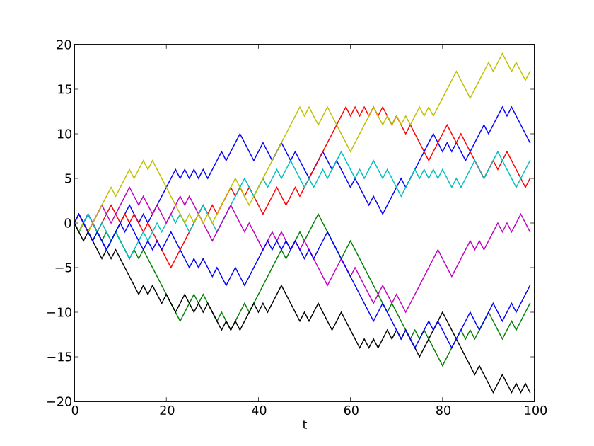

# Stochastic Process
For the derivative products we have considered so far, we were able to do a lot without a model for the price of the underlying asset. We were able to derive pricing formulas for these products from arbitrage considerations alone. This was possible because forwards, futures, and swaps are sufficiently simple instruments. In particular, they are linear instruments, ie their payoffs have a linear dependence on the underlying price. Options are non linear instruments, and we will need a model for the underlying asset price to analyze them.
Models for the underlying asset price will be based on stochastic processes. Some ideas that capture the essence of stochastic processes:
- A random evolution
- A random function
- Random paths

Let _S(t)_ be price of asset at time _t_ >= 0. At time 0, for _t_>= 0, _S(t)_ is a stochastic process.

