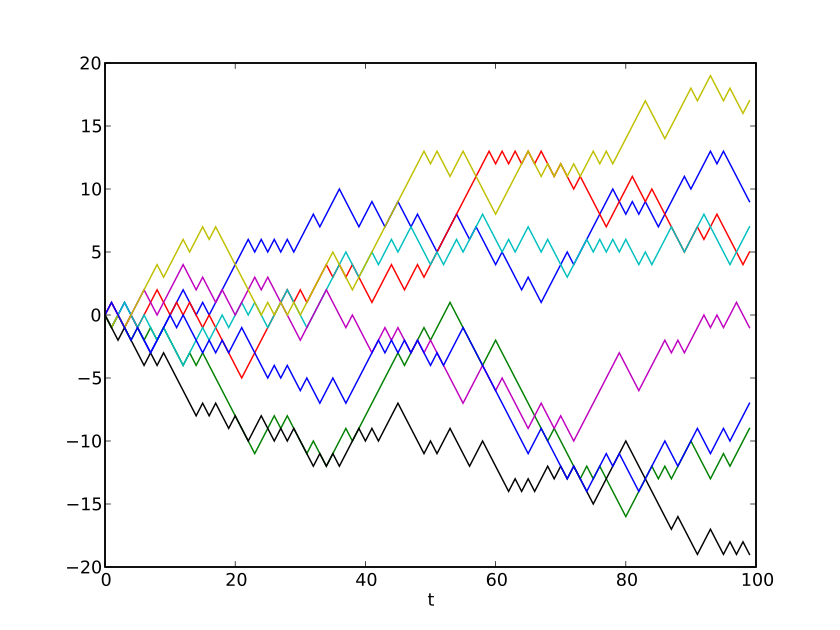

# Stochastic Process
A __stochastic process__ is a family of random variables _X(t)_ indexed by a parameter _t_ that can be interpreted as time.
__Stochastic Processes__ are of two distinct categories:
- __Discrete time stochastic processes__: are defined at specific time  that can be labelled with integers. Frequenctly the time dependence of discrete stochastic processes are denoted with subscripts:

- __Continuous time stochastic processes__: would be defined for any time _t_ with realized value _X(t)_.
- __Sample Paths__ of a stochastic process are the actual realized pathrs that could be followed by the stochastic process. Thus a stochastic process could be regarded as a probability distribution on the set of all sample paths.

## Random Walks
A Drone which can go up or down by one unit of height. A coin toss will decide whether it goes up or down. if heads, then 1 unit of height up, and if tails, one unit of height down. Lets say we get {THHHT}, and if we connect this we get a sample path. A difference sequence could have resulted in different sample path. Each path has a probability of being followed. 

__Formal Definition:__ Denote the _jth_ jump by , for integers _j_. The  are independent, and are identically distributed as:

 

  The random walk is defined as
  

  This is a discrete time stochastic process. Another example of a discrete stochastic process is a time series of eg. daily, weekly, or monthly prices, returns, or some other financial variable. We could denote this by  for times _j_ or  corresponding to successive days, weeks, etc. Suppose that the times  correspond to the closing times of successive business days. Then  might be the discrete stochastic process consisting of closing prices of some traded asset.

A __continuous time stochastic process__ could be denoted by _X(t)_ defined, for instance, for all _t > 0._ The following plots show sample paths from a particular continuous time stochastic process known as __Brownian motion__. 

Continuous time stochastic process cannot usually be constructed in as elementary a way as discrete time ones. Mathematically, continuous time stochastic processes are defined by specifying joint probability distributions for the random variables  for arbitary times . For instance, Brownian motion usually denoted by _W(t)_ is determined by specifying that for times  the random variables  are independent, and for any 

