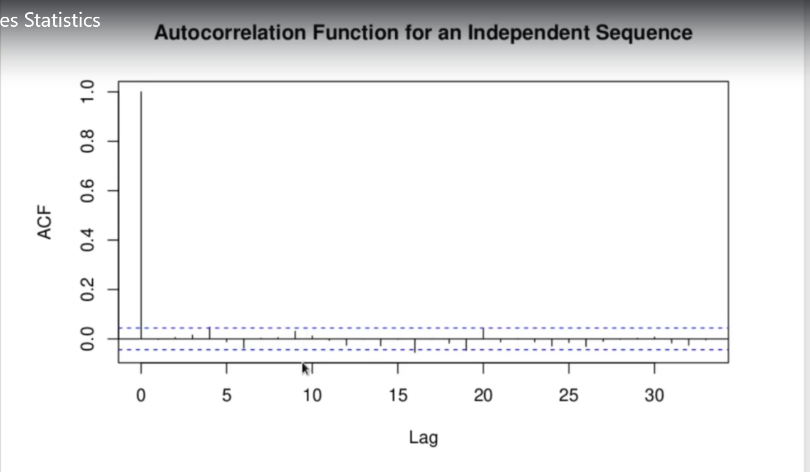
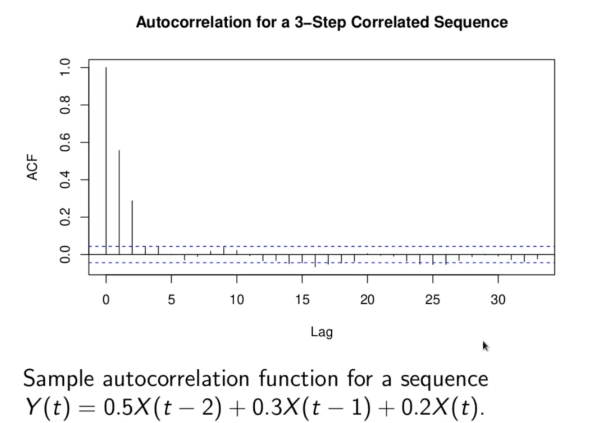

# Time Series Statistics

<h2>Autocorrelation Function of a Stationary Time Series:</h2>
Consider a time series:

It is called __strictly stationary__ if the distribution of 

only depends on _j_ and not _k_.

This means:  _X(k)_ has the same distribution as _X(1), X(k), X(k+1))_ has the same joint distribution as _(X(1), X(2))_ etc.

Strict stationarity is weakened to just stationarity if the condition holds only up to second moments.

The __autocovariance__ function for a time series _X(t)_ is

 

The time series is __stationary__ if its autocovariance function is translation invariant along with the expection  (ie  independent of _k_).

Translation invariance means:

This means  only depends on the lag _l-k_.

In other worjds, stationarity implies:

 
 
 
   

The same applies to nonsuccessive pairs:

as well as variances:

In the stationary case we may thus redefine the autocovariance function as:

This is independent of t.

So far a stationary time series the autocorrelation function is

which is also independent of t.

Note that  for any time series. 

<h2>Sample Autocovariance and Autocorrelation Functions:</h2>
Given a realized sample of a time series

 

and with the sample mean

 

the sample autocovariance function is

 

The same autocorrelation function is

 

We will plot the autocorrelaiton function for an independent sample _x(1), x(2) ... x(2000)_ from a standard normal, and for a lagged series

 

