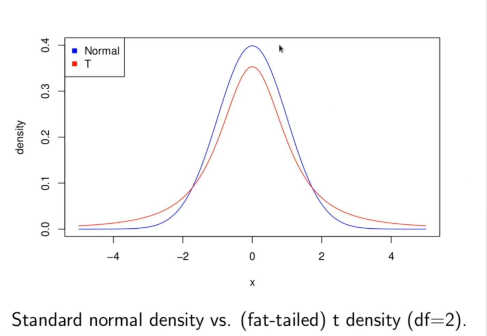
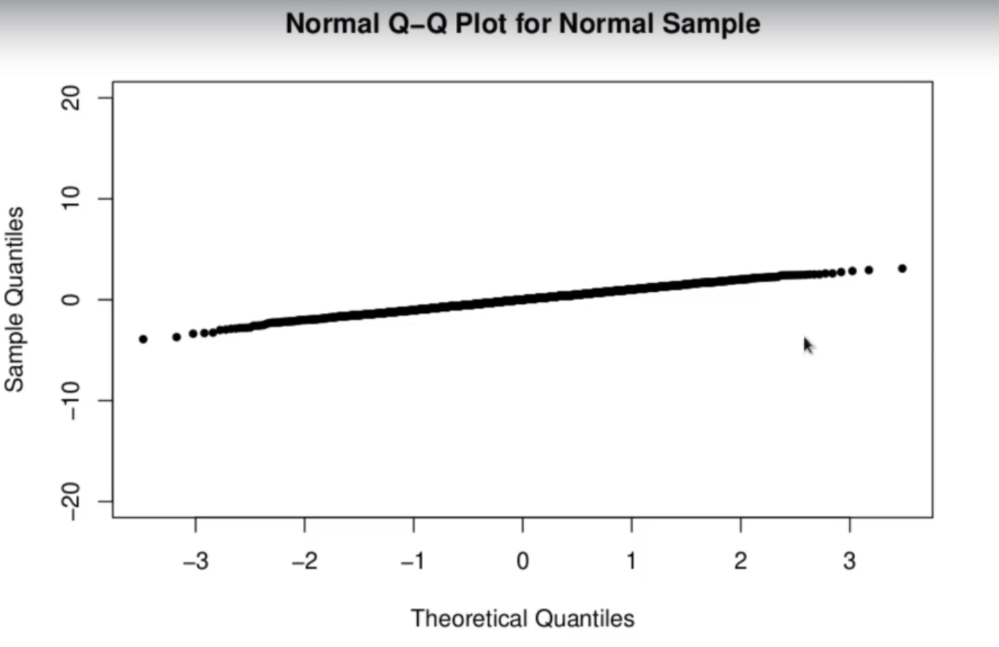
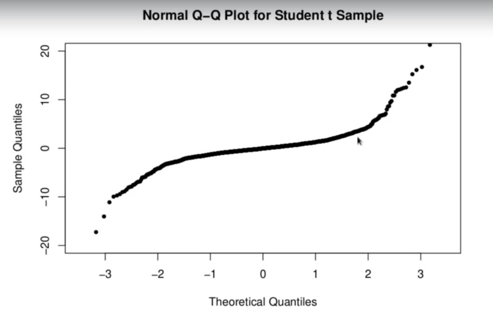

<h1>Fat-Tailed Distributions</h1>
The density of a normal distribution:

for a normal distribution with mean  and variance .

As  the normal density decays exponentially.

Probability distributions whose densities decay slower than exponeniatlly are referred to as __fat-tailed__.

Typically, a fat-tailed density decays algenraically, ie as a power . For instance, the Student t distribution with  degress of freedom has a density decaying as 

<h2>Normal Q-Q Plots:</h2>
Generally a quantile-quantile plot (q-q) is a plot of quantiles of one random sample against the quantiles of another.
A normal q-q plot is a plot of quantiles of the sample against the theoretical quantiles of a normal distribution.
<li>Key property of normal q-q plots: if a random sample  is from a normal distribution then it's q-q plot will be close to a straight line.</li>
<li>If the sample is from a fat-tailed distribution, its normal q-q plot will deviate from a straight line at extremes.</li>

<h2>Fat Tails and Kurtosis:</h2>
Kurtosis is a statistic related to the fourth moment of a random variable. It is thus even more sensitive to extreme values than the variance. 

The standard definition of kurtosis is as a normalized version of the fourth moment.

If _X_ is a random variable with mean  and variance  then the __kurtosis__ of _X_ is

The kurtosis of a normally distributed random varianle is 3. So, for any random variable _X_ we define its __excess kurtosis__ as

Excess Kurtosis = Kurt(X) - 3

As a fourth moment, the kurtosis is a measure of dispersion that is more sensitive to extreme values than the second moment, the variance.

Excess kurtosis, is a measure of how much more of a tendency there is for extreme values than a normal distribution.

Thus positive excess kurtosis is a measure of the fat-tailedness of a distribution.

The t distribution with 5 degrees of freedom has an excess kurtosis of 6 (it is undefined or infinite for  and decreases to 0 for larger .

We will use excess kurtosis as one measure of fat-tailedness in empirical return distributions.
