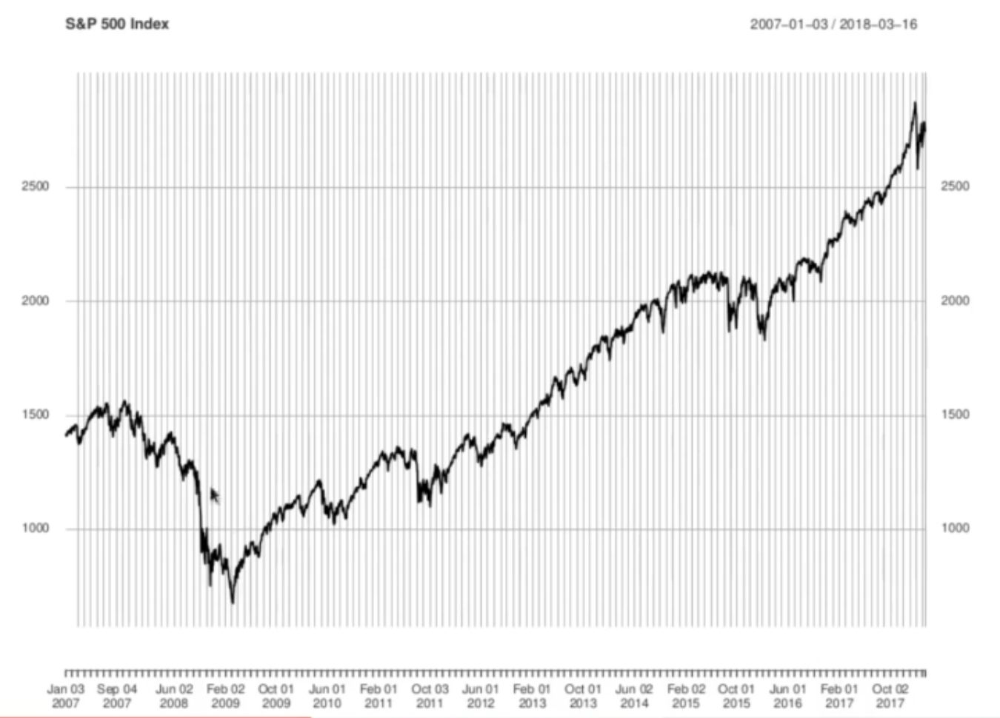
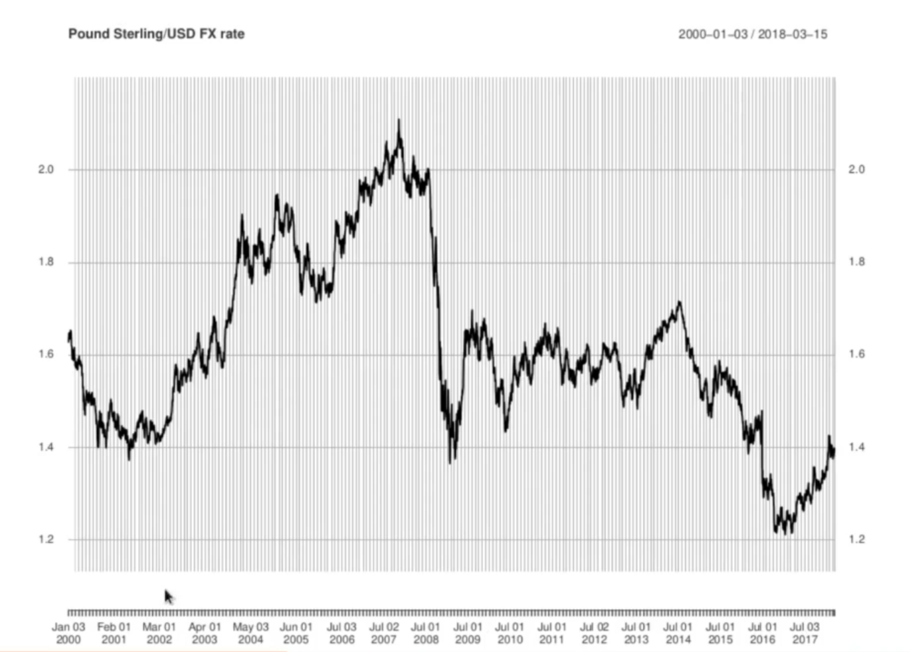
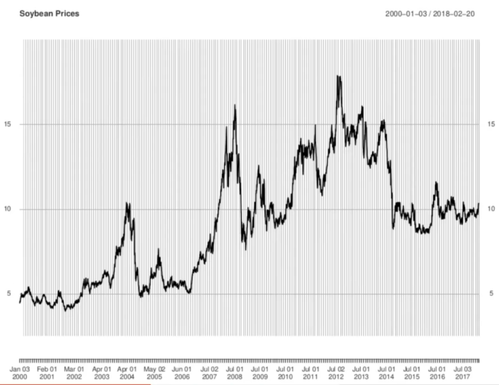

<h1>The Stylized Facts of Asset Prices</h1>

The following "stylized facts" hold for series of prices and returns for a wide range of asset classes.

<ol>
  <li><b>Volatility Clustering</b>: Asset pricees exhibit distinct regimes of low, intermediate, and high volatility.</li>
  <li><b>Raw returns series exhibit little to no autocorrelation</b>: Correlation between returns at different times is virtually 0.</li>
  <li><b>Absolute values of returns exhibit considerable autocorrelation</b>: The absolute value of returns at different times show considerable correlation which decays in time very slowly. This means that successive returns are uncorrelated but they are not independent.</li>
  <li><b>Fat Tails</b>: Asset returns have much fatter tails than Gaussian, excess kirtosis, etc.</li>
</ol>

Furhter, we will study the daily log returns from the price time series of 3 different assets: the S&P 500 index, the pound sterling/USD exchange rate, and soyabeans.

For each series we will analyze the log daily returns (continuously compounded returns)

We study these returns as a daily time series

with the  representing successive business days. First lets look at the raw prices.

