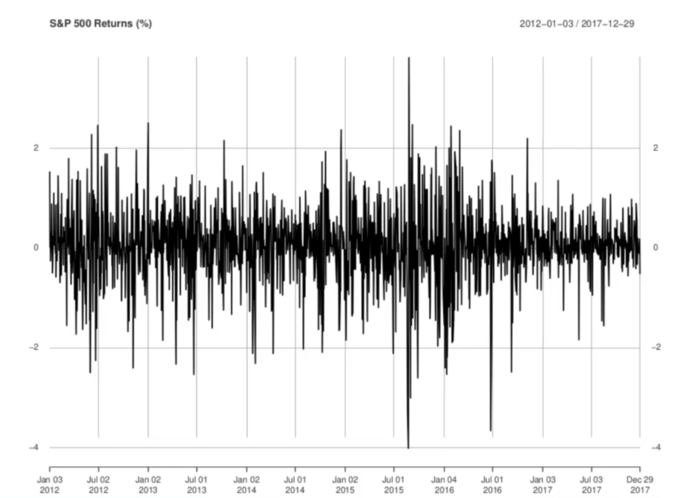
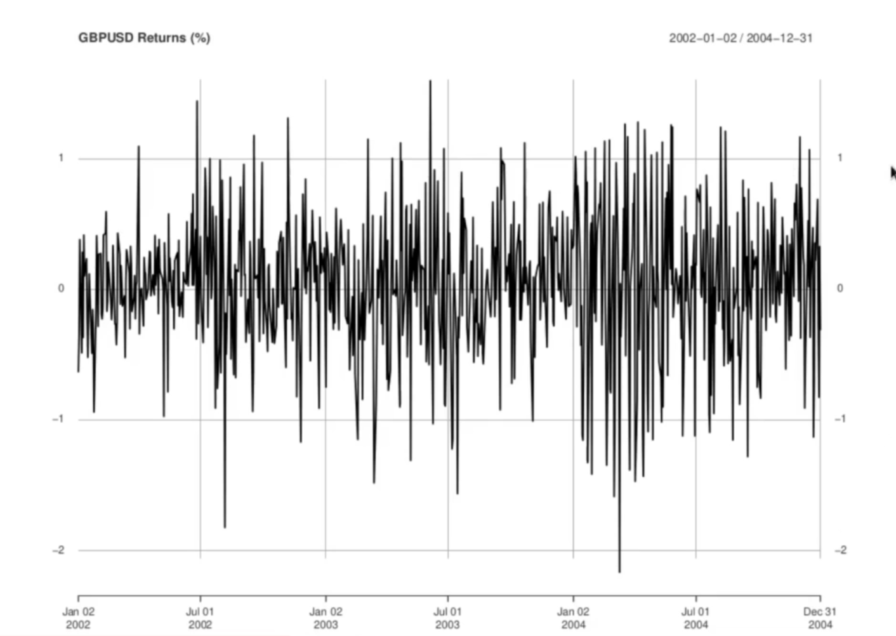
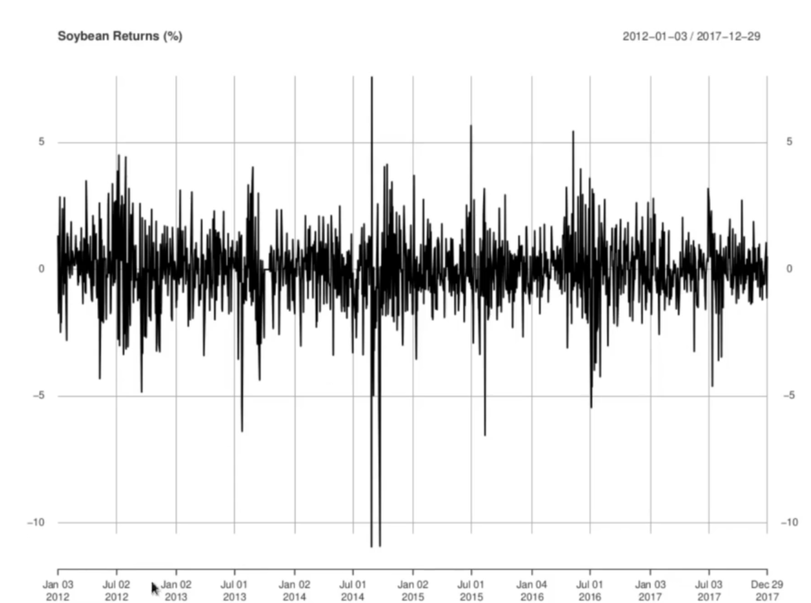

<h1>Volatility Clustering</h1>

The volatility refered here is price volatility,which does not necessarily mean returns volatility, only a high (absolute) returns level.

<ol>
  <li>In practice, volatile prices will imply volatile returns as well, because returns are not systematically positive or negative (the mean is close to 0), and will oscillate between plus or minus the absolute return level.</li>
  <li>It is much easier to observe volatility regimes from the returns.</li>
  <li>Another advantage to using returns: they are scaled properly, giving volatility as a percentage of the price level.</li>
  </ol>

Hence, we will use returns for our 3 price series to identify volatility regimes.

<h3>S&P 500 Returns</h3>

Last 18 months is period of low volatility compared to earlier time period. 2015 year saw high volatility, especially in second half.

<h3>Sterling Pound/USD Exchange rate</h3>

<h3>Soyabean returns</h3>

