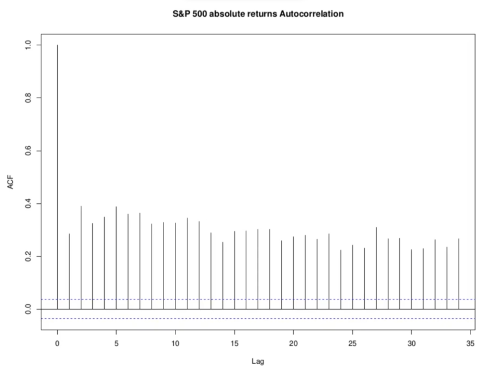

<h1>Asset Return Autocorrelation</h1>

For an returns series _r(t)_, the sample autocorrelation function  for any .

Similarly, for the time series of absolute value of returns  for _k_ not too large, and decays to 0 slowly as _k_ increases.

We will look at the sample autocorrelation function for the raw returns, and for the absolute values of returns, on the S&P 500 Index, the GBP/USD exchange rate, and on soyabeans.

<h2>S&P 500 Index</h2>
<h3>Autocorrelation for Raw Returns</h3>

Some correlation at 1 day returns could be due to when after huge fall or huge increase investors jump in to take advantage of the anamoly. This could also be due to sampling error. Ideally due to sampling error, we might see 1 out of 20 lags turning out to be significant in autocorrelation plot. There is difference between statisitcally significance and real life implications. These are now not like law of Phyiscs, that they can't be broken. Some times we do observe some outliers, doesn't mean that it is true.

<h3>Autocorrelation for Absolute Returns</h3>

<h2>POUND-USD Exchange Rate</h2>
<h3>Autocorrelation for Raw Returns</h3>

<h3>Autocorrelation for Absolute Returns</h3>

<h2>Soyabean</h2>
<h3>Autocorrelation for Raw Returns</h3>

<h3>Autocorrelation for Absolute Returns</h3>

