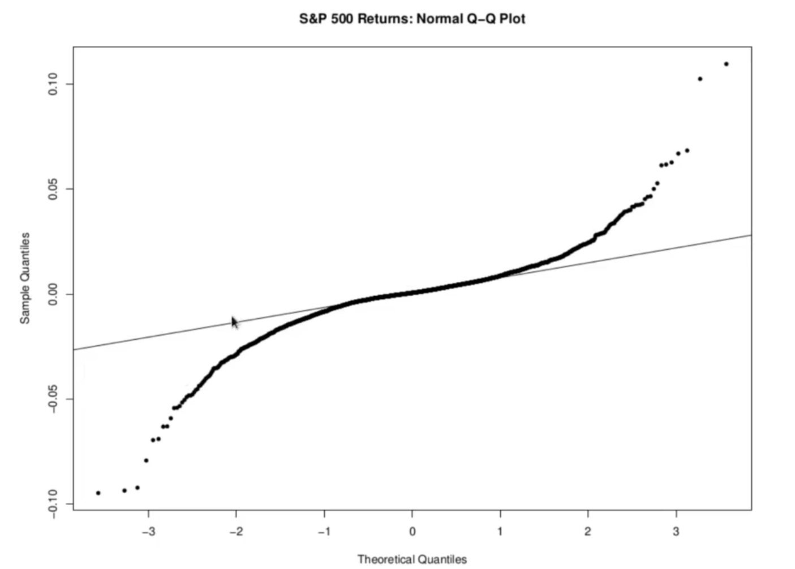
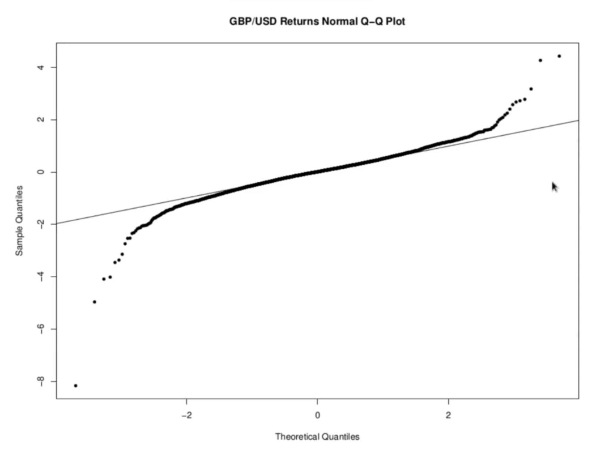
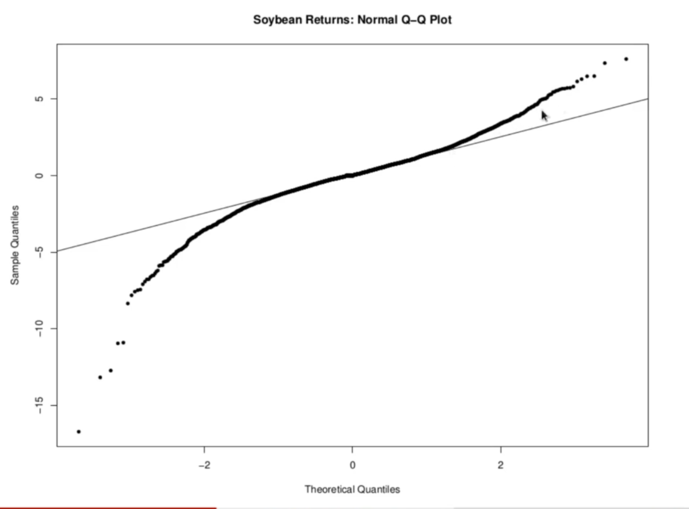

<h1>Fat Tail of Asset Returns</h1>

Fat-tailedness of asset returns is a widely observed phenomenon in markets. While this is true for daily returns, it gets less and less true as we increase the horizon. Monthly return data shows significantly less evidence of fat tailes or nonnormal behavior.

We will investigate whether returns on our 3 assets exhibit fat tailes by plotting a normal q-q plot for the return series for each one. We will also report the exces kurtosis for each of our return series.

<h2>S&P 500 Returns Q-Q Plot</h2>
  
Excess Kurtosis: 10.84
 
 
 

<h2>POUND-USD Returns Q-Q Plot</h2>
  
Excess Kurtosis: 11.63
  
 

  
  
<h2>Soyabean Returns Q-Q Plot</h2>
  
Excess Kurtosis: 9.19
 
 

