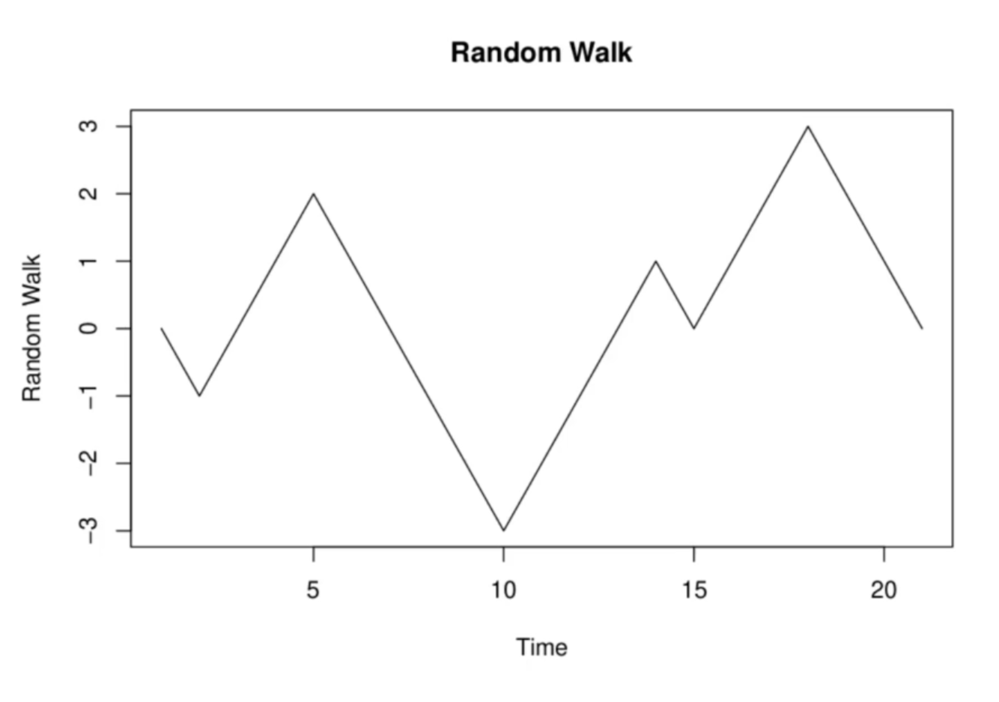
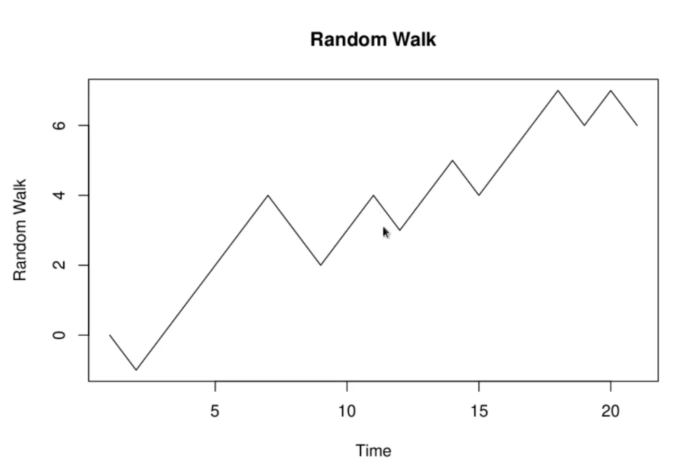
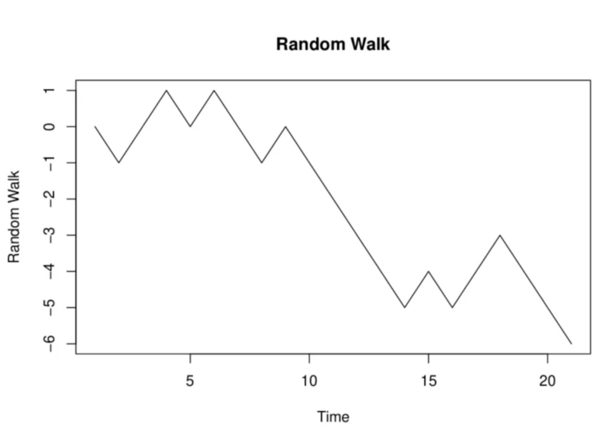
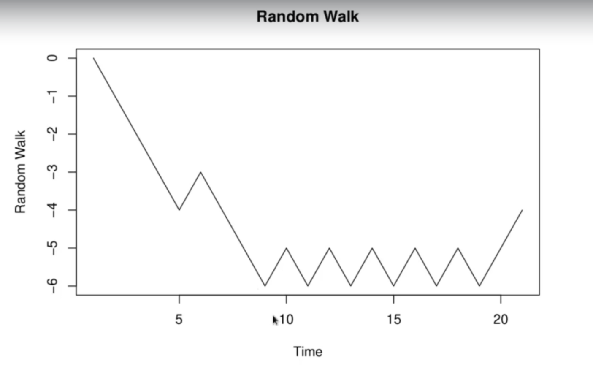
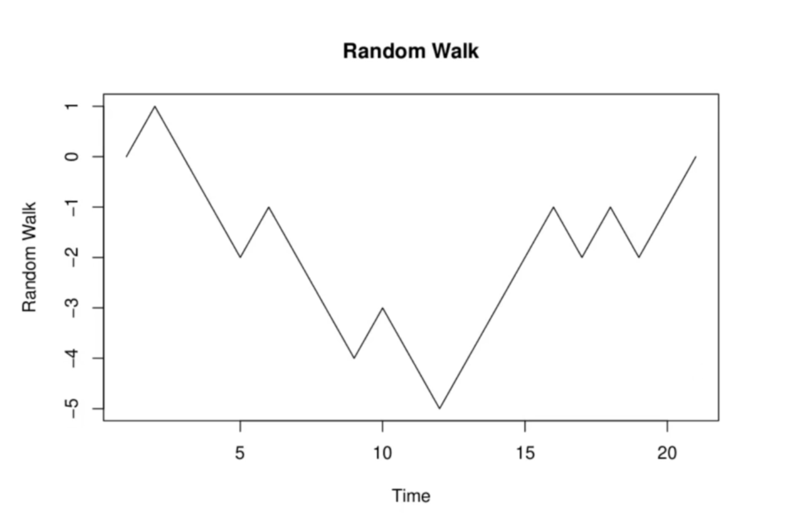
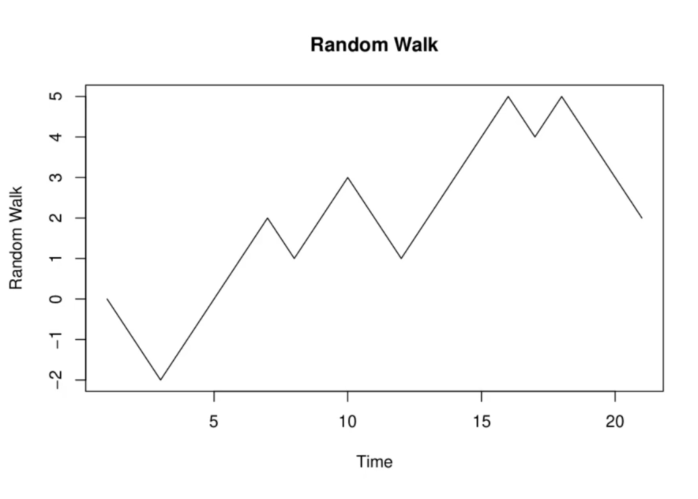

<h1>Random Walks</h1>
We will suppose the hopping particle to be a bot, either autonomous or remote controlled. Either way, the dynamics of the bot are to hop up or down the levels
         ...., -2, -1, 0, 1, 2, ...
according to the flippin go of a coin.

<h2>Examples of Random Walks</h2>
<h3>Random Walk 1</h3>
There is no general trend, just goes up and down.

<h3>Random Walk 2</h3>
The general trend is upwards. On the way up, it bounces a lot.

<h3>Random Walk 3</h3>
This is opposite of last one. The general trend is downwards.

<h3>Random Walk 4</h3>
There is a very long run of upruns. This is also perfectly normal behavior. They are rare though

<h3>Random Walk 5</h3>
Went to zero pretty quickly.

<h3>Random Walk 6</h3>
Falls a downward trend, and then upward trend.

<h3>Random Walk 7</h3>
General upward trend

<h2>Modelling of Random Walk</h2>
The dynamics can be modelled as follows:
<ol>
  <li>The bot starts at position 0.</li>
  <li>At time 1, flip a coin. If heads, hop the bot from 0 to 1. If tails, it hops from 0 to -1.</li>
  <li>At time 2, starting from the new position (-1 or +1) flip the same coin again, and hop, either up or down according to the same rule as in step 2.</li>
  <li>Repeat the procedure for n steps total, hopping the bot along step by step.</li>
  </ol>
  
The coin could be a fair coin, in which case a jump up has the same probability as a jump down, 1/2. But we don't assume that the coin is fair. Thus, probability of jumping up and down can be arbitary and won't be equal to 1/2. So, all we will assume is 

Prob (jump up) = p and Prob (jump down) = q = 1 - p

We do assume the same coin is flipped at every jump, meaning that the probabilities _p_ and _q_ are the same for every jump, or at every timestep. We also assume that each coin flip is independent of all the others, so that the fact that we got a head on the previous flip tells us nothing about what will happen in the next flip. The circumstances described so far may be represented in mathematics as follows:

<ul>
  <li>Each hop is represented by a random variable;  is the jth hop.</li>
  

  
  

  <li>The sequence of jump random variables are independent, as well as identically distributed.</li>
  

  
  

  <li>This implies, in particular (Here </li>
  

  
  

</ul>

Our position after _n_ jumps is the sum of the _n_ jumps:

 
   

The discrete time stochastic process  is what is called a __random walk__.

For a general random walk, the jumps  can have any distribution. The basic assumption for a random walk is that they be independent and identically distributed. We will though only consider jumps that take the values of +1 and -1.

<h3>Example</h3>
What is the probability of starting off with 2 up jumps followed by a down jump?

