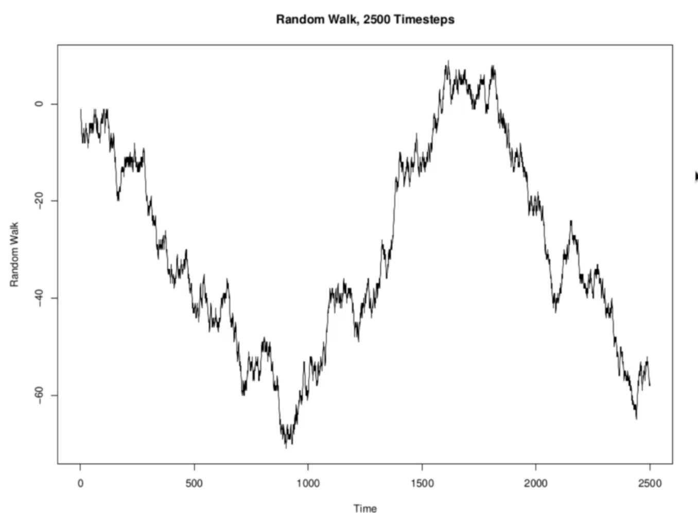
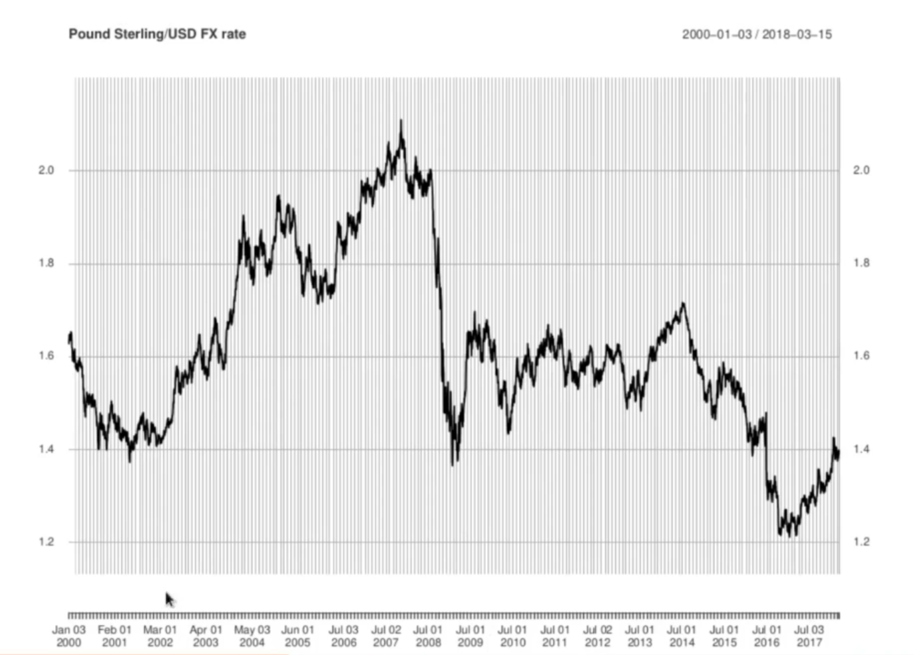

<h1>Random Walks as Models for Asset Prices</h1>
We usually think of an asset price as something evolving continuously in time - at least, while markets are open. Thus a discrete time model like a random walk would seem to be very unrealistic. Additionally, the fact that the random walk only jumps by some fixed increment every time it does jump also does not seem accurate. Asset prices can jump by almost any dollar amount at all. In fact, these critisms are not as serious as they seem.

At level of general trend, it dropped down for couple of years, reached low at financial crisis, and there on kept on rising and rising. This is very similar to below random path. Though it misses out lot of small increments and decrements (oscillations) on daily basis. Though these binary random walks don't capture at detailed level what S&P 500 is doing.

The S&P chart has 11 years of data, and it captures index value for every trading day in those 11 years. In 11 years there are approx 2700 trading days. Hence, in random walk terms, there are 2700 steps being plotted. 

<h3>Random Walks with 2500 Time Steps</h3>

Real USD-Sterling plot shows two behaviors - periods of time where there are lot of oscialltions and then there are periods where there are big shocks (up or down). Similar behaviour is observed in random walk. Hence, at a certain level, the simulated random walk is similar to Sterling-USD exchange rate.

<h2>Objections Raised Earlier to Random Walk Models</h2>
<li>We might, for instance, choose to model daily prices perhaps the closing price every trading day. Or we might model weekly or monthly prices, possibly averaged over the desired timeframe. In that case, a discrete time model would be appropriate. </li>
<li>We could also approximate jumps of arbitary size using several jumps with fixed size. THese observations sugest that we might find a better model by taking some kind of limiting case of the random walk as the size of the jumps get small but the frequency of jumps increases.</li>

NOTE: There are some serious deficiences in using the random walk as an asset price model, which will be addressed in future notes.
