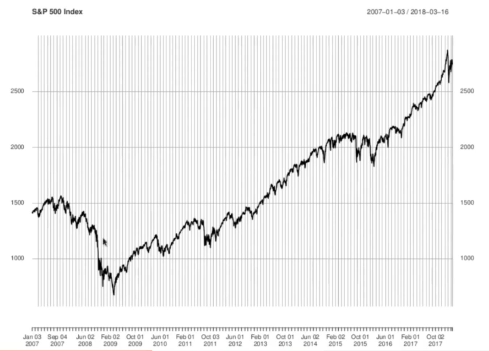
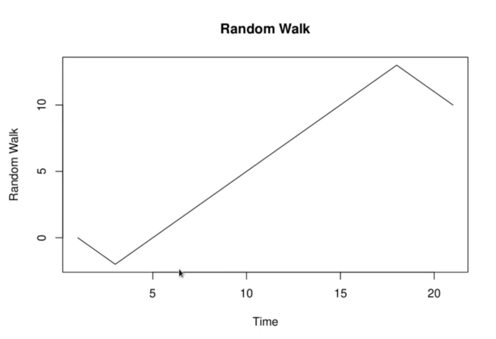

<h1>Random Walks as Models for Asset Prices</h1>
We usually think of an asset price as something evolving continuously in time - at least, while markets are open. Thus a discrete time model like a random walk would seem to be very unrealistic. Additionally, the fact that the random walk only jumps by some fixed increment every time it does jump also does not seem accurate. Asset prices can jump by almost any dollar amount at all. In fact, these critisms are not as serious as they seem.

At level of general trend, it dropped down for couple of years, reached low at financial crisis, and there on kept on rising and rising. This is very similar to below random path. Though it misses out lot of small increments and decrements (oscillations) on daily basis. Though these binary random walks don't capture at detailed level what S&P 500 is doing.

The S&P chart has 11 years of data, and it captures index value for every trading day in those 11 years. In 11 years there are approx 2700 trading days. Hence, in random walk terms, there are 2700 steps being plotted. 
