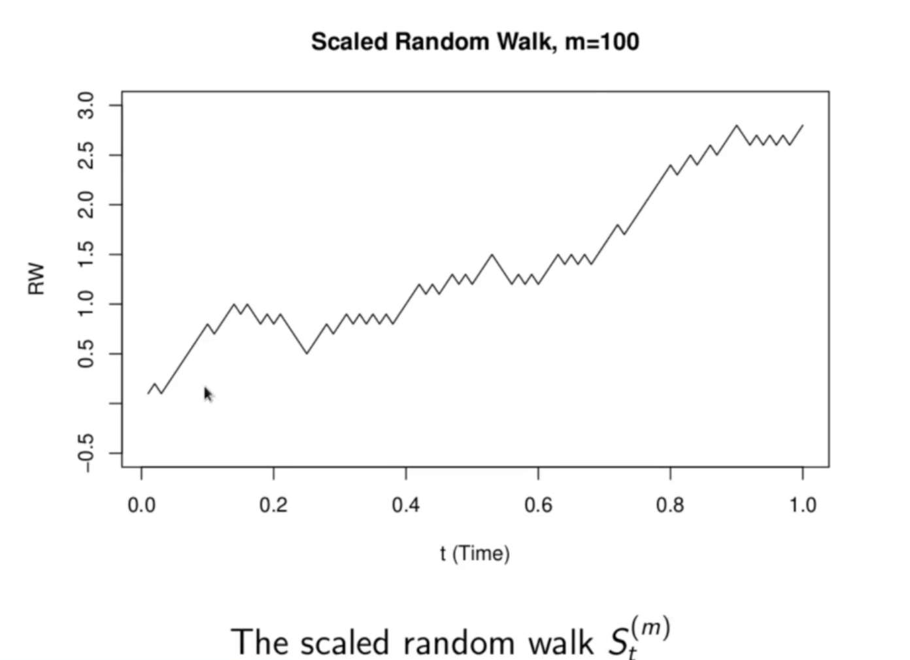
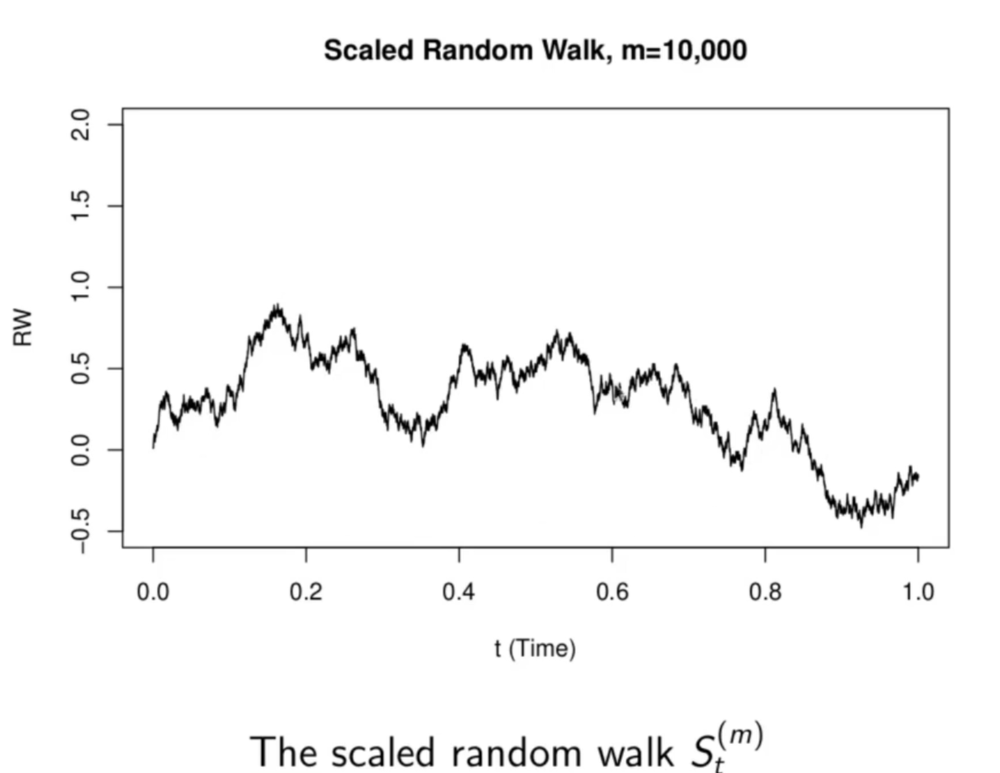
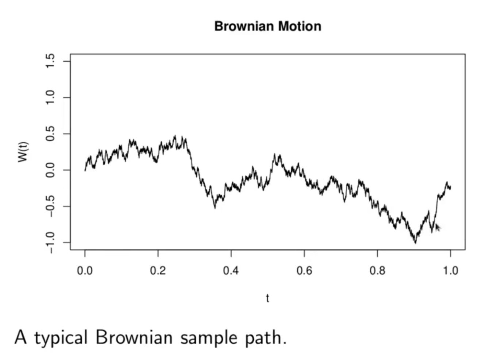

<h1>Brownian Motion</h1>
To develop a more realistic model for asset prices, which still retains the properties of random walks we ant to keep, is to derive a continuous time model from random walks. One way to do this is to take the limit as the time step in the random walks get infinitely small, or in other words, take the limit as the number of jumps in any unit of time goes to infinity. If we do this, we must scale down, or shrink the size of the jumps. Otherwise, for instance, the variance will go to infinity. Let 

 
   
   
   
   

The jumps  of size 1 must be scaled down for the limit to be sensible. The jumps should be reduced by dividing by some factor:

The cental limit theorem suggest that . Below derivaiton suggests that   is the right scaling.

 
   
   
   
   
   
   

We wish to consider the limit as the number of timesteps _m_ per unit time gets large. For any real time _t >= 0_ the number of jumps will be some integer close to _mt_. So we consider the scaled random walks

__Explanation:__ Above chart shows 100 jumps scaled random walk.

<h2>Definition</h2>
__Brownian motion__ is a continuous time stochastic process, conventionally denoted _W(t)_ with following properties:

<li> W(0) = 0 with probability 1.</li>
<li>The sample paths of W(t) are continuous with probability 1.</li>
<li>For t< s < r W(s) - W(t) is independent of W(r) - W(s).</li>
<li>For any t, s >= 0, W(t) - W(s) is normally distributed with mean 0 and variance |t-s|.</li>

It is consequence of the central limit theorem that the distribution of any increment  converges to a normal as . The independence of jumps in the random walk passes to independence of increments in the limit. And it is intuitively clear, from observing the limiting behavior of the sample paths, that the random walk converges, as a stochastic process, to Brownian motion. In fact, the random walk converges to Brownian motion in a very precise sense:

in the sense of "weak convergence of stochastic processes".
