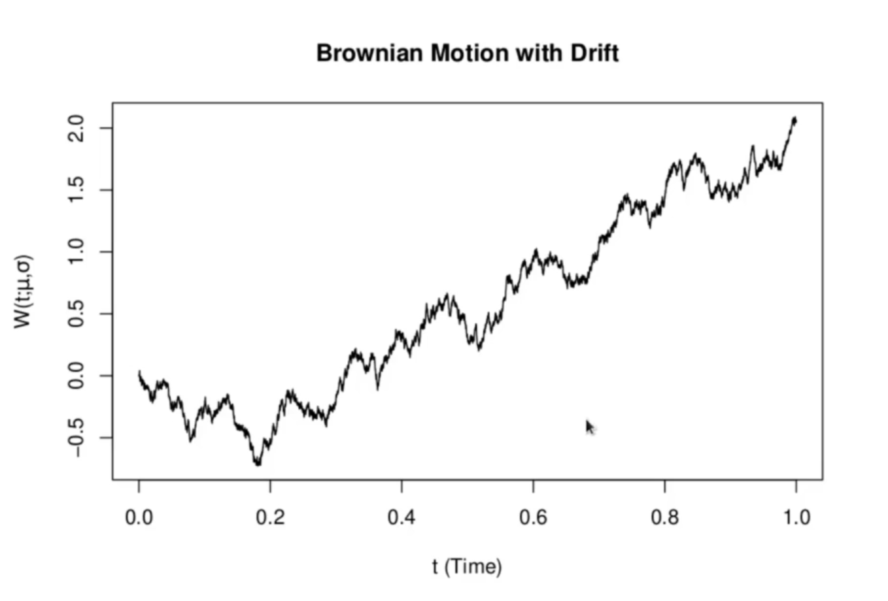
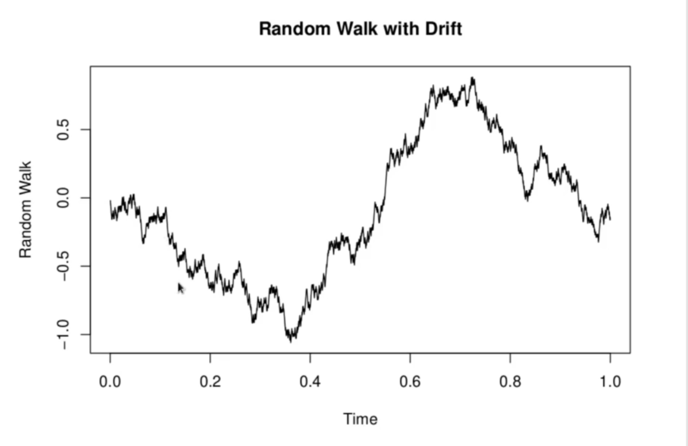

<h1>15 Brownian Motion with Drift</h1>
Assets can enjoy a certain trend. As observed in below S&P 500 plot. To be a suitable representation of asset prices, it is desirable for a model to support a trrend. Brownian motion is not sufficient for this (the expectaiton stays 0 for all time). This is remedied by adding to Brownian motion a term representing a trend. It is also desirable to add a volatility factor .

__Brownian motion with drift__ is the stochasitc process

 
   

The above is very similar to S&P 500 series. In general this doesn't happen that often. Allowing drift brought the brownian motion close to actual series.

<h2>Random Walk with Drift</h2>
One should first note that the addition of the drift term does provide any advantages over the random walk: we could also add a discrete drift term to the random walk. We could simply add a drift term  to the random walk, so that a random walk with drift would be

 
   

