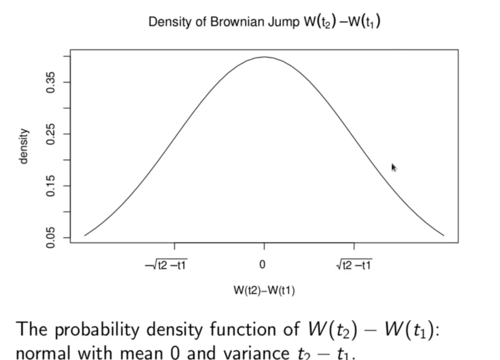

<h1>16 Brownian Motion and Asset Prices</h1>
<li>Brownian Motion allows implementation of EMH due to independence of jumps/increments.</li>
<li>__Continuous in Time and Flexible Jump Sizes__: The discreteness of the random walk model, though sometimes an appropriate model, is stil a limitation. It is desirable to have a continuous time model available for some applications (eg market microstructure). Also random walk is a crude model, only allowing jumps of a fixed size for every timestep. The Brownian motion model remedies these shortcomings. Brownian motion is a continuous time model. It may be thought of as a continuous time version of the random walk. And Brownian motion allows the increment or jump  has a normal distribution. But the greater the time increment  the more likely are larger jumps since the variance is exactly . These are reasonable properties.</li>
  
 
  
<li>__Negative Asset Prices and Jumps insensitive to Price Level__: Not all the limitations of the random walk model have been addressed by Brownian motion. Other problems were that random walks take negative values with positive probability, and that the jumps in the asset price do not scale with the overall price level. These problems persist with Brownian motion. Brownian motion (even with a drift term) still has a positive probability of taking negative values. And the volatility of prices is still insensitive to the absolute price level. Regardless of the value of </li>

