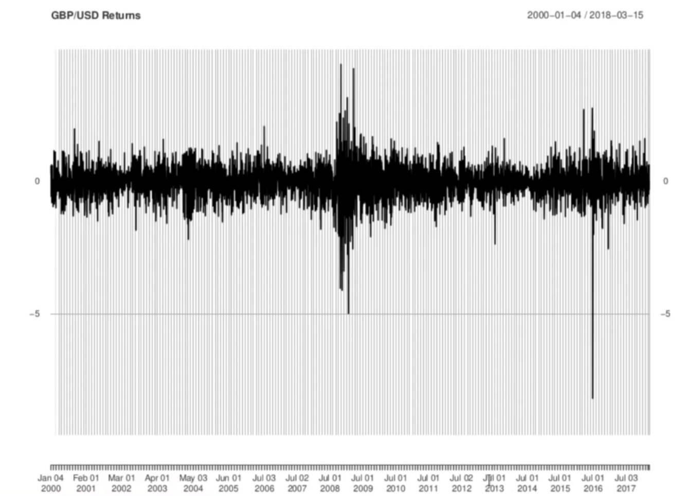
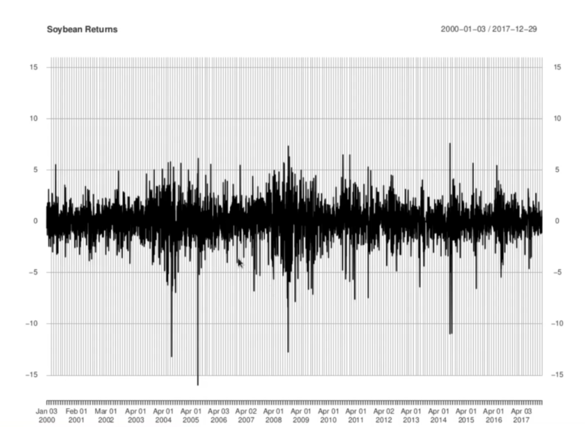
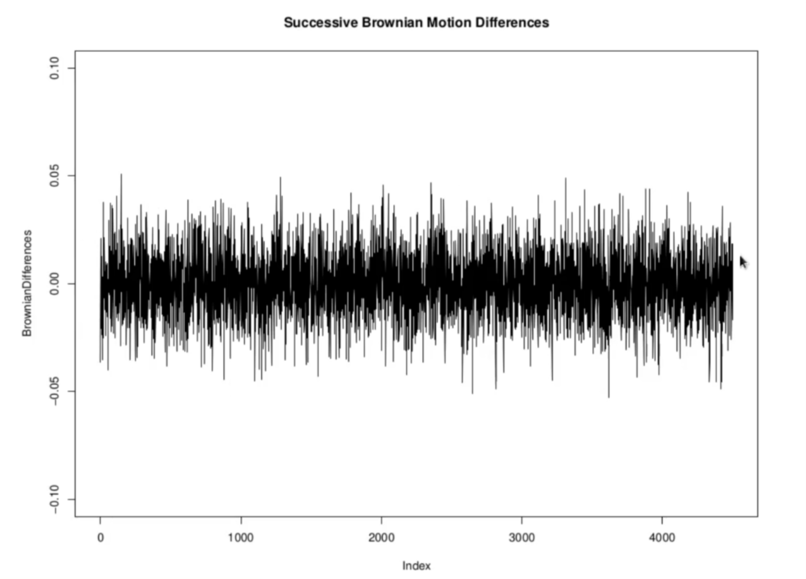

<h1>The Log-Normal Model</h1>
Here, we will further modify the Brownian motion model to remedy some of the outstanding problems. Like the random walk model Brownian motion has a significant probability of attaining negative values. Adding a drift term reduces this probability, but does not eliminate it. More serious is the limitation shared by both the random walk and Brownian motion that the size of the jumps does not scale with the price level: a $10 jump is just as likely for an asset trading at $15 as one trading at $250. We wil like to extend the model to remedy these defects, while still preserving the elements of market efficiency implicity in the independence of increments. _S(t)_ denotes the asset price.

We consider changes in _log(S(t))_. Let 

 
   

If  then 

 
   
   
   

So the price jump can be written as

 
  

This relationship holds no matter what the overall price level. We could multiply the prices by 2, 10, 100, or any other factor and still the price jump would be the constant  times the initial price. So a fixed additive jump in _log(S(t))_ implies a price jump that scales witht he price level. A model in which the dynamics involve jumps of fixed size (on average) in _log(S(t))_ would have the sensitivity to the overall price level we are seeking. This suggests the idea of modelling _log(S(t))_ as Brownian motion (or a random walk) rather tha _S(t)_ itself.  

We may also look at this from the point of view of stationarity. Strict stationarity means the multivariate distribution of returns does not change with time; stationarity means this is true up to second moments, variances and autocorrelations. Empirically, asset returns tend to be stationary over reasonable periods of time. And this is what we would expect in principle (primacy of returns). But returns and price jumps cannot both be stationary. A 10% return implies a $1 jump for a stock trading at $10 but a $20 jump for a stock trading at $200. If we want returns to be stationarity, then we have to give up price levels being stationarity. 

In financial economics and econometrics, the consensus view is that asset returns are stationary, at least as a first approximation. Therefore it is reasonable to choose asset price models that lead to stationary returns. These considerations lead us to consider modelling _log(S(t))_ as a Brownian motion rather than _S(t)_ itself.

For the returns we will then have

From the properties of Brownian motion the sequence of Brownian differences _W(t) - W(t-1), W(t+1) - W(t), ... , W(t+k) - W(t+k-1)

are stationary as well as uncorrelated (independent in fact). Thus the log returns will also have these properties. Thus, modelling _log(S(t))_ as Brownian motion accomplishes 3 things:
<ol>
  <li>Average price jumps are proportional to the price level.</li>
  <li>Returns are stationary.</li>
  <li>Returns are uncorrelated.</li>
  </ol>

<h3>Pound-USD Returns</h3>

The returns are stationary in normal circumstances but there are external shocks which may divert the behavior. In long period of time period (18 years in above chart), we would observe few years of stationarity (till 2008, and then financial crisis hit and we observe high volatility).

<h3>Soyabean Returns</h3>

High volatility in earlier period (2004 to 2005) and again in financial crisis (2008-2010). 2000 to 2003 and 2011 to 2020 we could identify the regime of stationarity. 

<h3>Successive Brownian MotionDifferences</h3>

This model is not going to exhibit volatility clustering. And also there are no big shocks. 

<h2>Log-Normal Model</h2>
It is standard to add a drift term and a volatility factor 

Also, an initial value _S(0)_ should be included:

We may then exponentiate both sides of this equation. The below equation is called __log-normal model__ of asset prices. Another term commonly used is __geometric Brownian Motion.__

