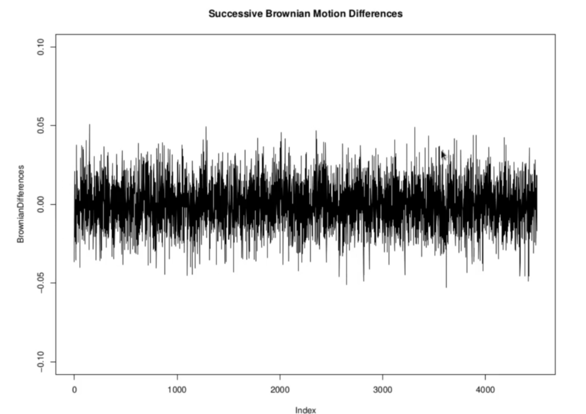

<h1>Log-Normal Model and Asset Prices</h1>
The outstanding deficiencies that had not been corrected by Brownian motion were that asset prices still had a positive probability of taking negative values, and that price increments were insensitive to the overall price level. In this lecture, we will investigate how well the log-normal model has corrected these problems. The log-normal model for an asset price _S(t)_:

_S(t)_ would usually be the price of a commodity, a foreign exchange rate, a stock price, or some other case product. One can think of a stock for definitenes. 

First, we address the issue of negative prices: as long as _S(0) >= 0_ then _S(t)_ cannot be negative. So this problem has been corrected.

As a measure of the typical size of the jump _S(t + 1) - S(t)_ in the asset price in 1 unit of time (typically days) we use the standard deviation:

We have:

 
   
   
   
   

Now taking differences

For calculating the variance, we will assume _S(t)_ is known. Equivalently, we are computing the variance conditionally, given the information known at time _t_. This is an appropriate calculation, since we are trying to understand how the variance of the price jump depends on the existing price level. To calculate the variance, note that

is a standard normal (mean = 0, variance = 1) random variable (defining property of Brownian Motion). We may thus calculate the variance of a price jump as

 
   
   

because we are treating _S(t)_ as known (ie deterministic). The standard deviation of a price jump is thus

 
   
   
  

where _B > 0_ is some universal constant.

For definiteness (using  )

 
   

All that matters is that _B_ is a constant only depending on , known model parameters, and is independent of the price level _S(t)_. We thus have standard deviation of jumps = _BS(t)_ ie jump size is proportional to price levels.

So, in the log-normal model, jumps scale with the price level, as they should: If the price doubles, jump sizes will on average be twice as big. The log-normal model solves the problem of insensitivity of price jumps to the overall level of prices. The log-normal model also inherits, from Brownian motion, the independence of increments, and thus remains an implementation of the EMH. 

Thus the log-normal model has preserved the desirable features from the random walk, and has remedied all the limitations that we have considered so far. Unfortunately, the log-normal model still has many shortcomings as an asset price model. 

<h2>Log-Normal Model Shortcomings</h2>
<li>Successive daily remains will be independent, not just uncorrelated. Hence, the model cannot replicate volatility clustering and the autocorrelation function for absolute return values will be 0. This is, the returns being Brownian differences</li>

 
   

<h3>Pound-USD Returns</h3>

The returns are stationary in normal circumstances but there are external shocks which may divert the behavior. In long period of time period (18 years in above chart), we would observe few years of stationarity (till 2008, and then financial crisis hit and we observe high volatility).

<h3>Soyabean Returns</h3>

High volatility in earlier period (2004 to 2005) and again in financial crisis (2008-2010). 2000 to 2003 and 2011 to 2020 we could identify the regime of stationarity. 

<h3>Successive Brownian MotionDifferences</h3>

This model is not going to exhibit volatility clustering. And also there are no big shocks. 

<h3>Successive Brownian Motion Differences</h3>

We should compare only returns of real asset in some regime of stationarity to simulated models. In real asset returns, we observe lot of volatility clustering. There is no volatility clustering in log-normal model. This is due to successive returns are independent. And since the distribution of Brownian increments _W(t+1) - W(t)_ is normal, asset returns will not have fat-tailed distributions in the log-normal model. 

From this discussion, it is clear that the log-normal model will fail to reproduce many widely accepted empirical properties of real asset prices. It must be regarded as an approximate model that at best captures gross features of asset prices but cannot be faithful to true asset price behaviour at a detailed level. In spite of these limitations, the log-normal model is de facto standard asset price model in financial analysis. It is the base model for option pricing, and its limitations must be remembered when working with standard option pricing models. 
