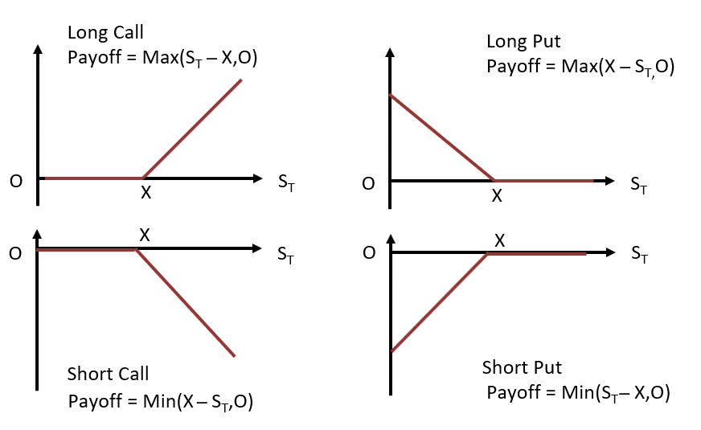

<h1>Option Payoffs</h1>
Similar to forward contracts, option payoffs are central to their valuation. The payoff of a derivative contract is equal to the revenue it pays to a particular counterparty (more properly, we consider the payoff of a particular option position). Note that option paypff=option value (at the time of the payoff). For European options, the option payoff is the value of the option at expiration. 

<h2>Notation for Options</h2>

<li><i>S(t)</i> = underlying price at time <i>t</i>. (Think of a stock for a definite asset).</li>
<li><i>K</i> = strike price.</li>
<li><i>T</i> = expiration date.</li>
<li><i>C(S(t)) = C(S(t), t) = C(S(t), t; K, T)</i> = call price.</li>
<li><i>P(S(t)) = P(S(t), t) = P(S(t), t; K, T)</i> = put price.</li>

__Remark__: Note the meaning of "call price" and "put price" is the value of the long posiiton in either of these contracts. In particular, _C(S(t), t)_ is the call premium at time _t_ and _P(S(t), t)_ is the put premium at time _t_.

<h3>Long Call Payoff</h3>

If we hold the long position in a European call, then we have the right at expiration to buy the underlying for the strike price _K_. It is only economically preferable to do so if _S(T) > K_. Thus if _S(T) > K_ we will exercise. We therefore:

<ol>
  <li>Pay the strike price K.</li>
  <li>Receive the asset, worth S(T).</li>
  <li>And thus profit S(T) - K </li>
</ol>

If S(T) <= K we will not exercise. In this case, the option expires worthless, and our payoff is 0.

Putting above two cases together, the long call payoff can be written as

 K"> 
   
   

<h3>Short Call Payoff</h3>
The short call payoff is simply the negative of the long call payoff:

<h3>Long Put Payoff</h3>

If we hold the long position in a European put, then we have the right at expiration to sell the underlying for the strike price _K_. It is only economically profitable to do so if _S(T) < K_. Thus, if _S(T) < K_ we will exercise. We therefore:

<ol>
  <li>Transfer the asset, worth <i>S(T)</i>, to the short.</li>
  <li>Receive the strike price <i>K</I>.</li>
  <li>The profit is <i>K - S(T)</i>.</li>
</ol>

If _S(T) >= K_ we will not exercise. In that case, the option expires worthless, and our payoff is 0. 

Putting the 2 case together, the long put payoff can be written as

 
   
   

<h3>Short pUT Payoff</h3>
The short put payoff is simply the negative of the long put payoff:

<h3>Option Payoffs - Diagram</h3>

