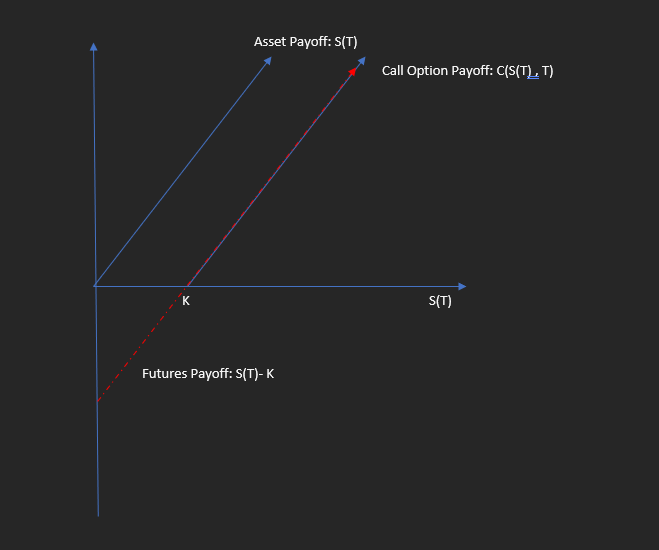
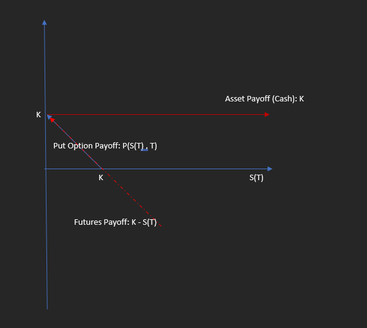

<h1>Arbitrage Bounds on Options: Geometry</h1>

<h2>Call Option Payoffs</h2>

From graph, 

Long forward payoff <= Call Option Payoff <= Underlying asset itself. By law of 1 price, these bounds should also be applicable at any earlier time.

<h2>Put Option Payoffs</h2>

From graph, 

Short forward position <= Put Option Payoff <= Cash (K)
