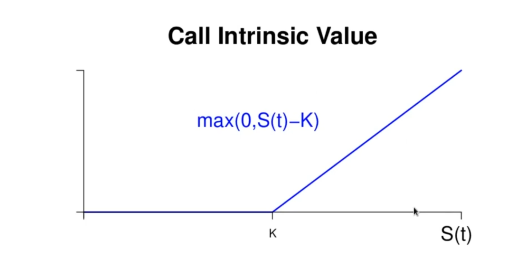
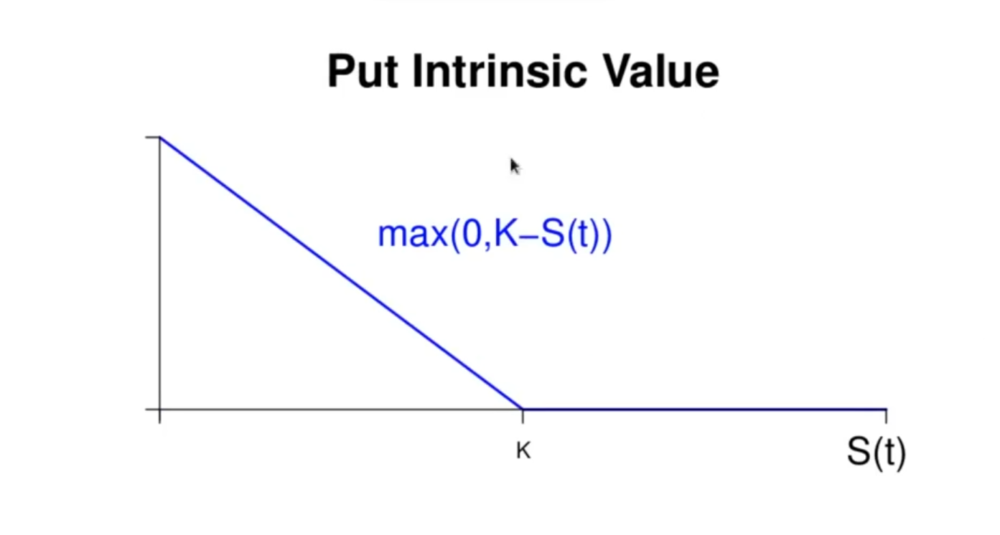
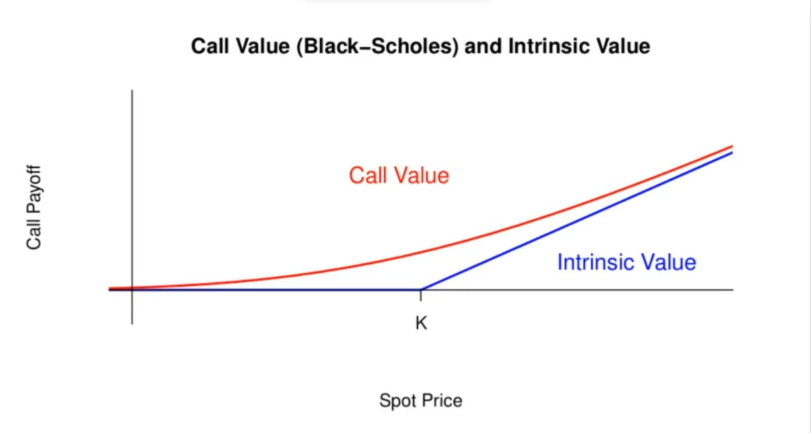

<h1>Bounds on American Options</h1>
We will consider American options on a stock (or other asset) that does not pay dividends. It is possible to derive similar upper and ;pwer bounds for American options, just as European options. The first thing to realize is that nay lower bound for a European option is also a lower bound for an American option. This is because an American option has more optionality than a European option. Therefore the price of an American option must be at least as much as the price of a European option. 

__Intrinsic Value:__ The intrinsic value of an option is the value that could be derived from it at som epoint in its life if it were exercised. An option's intrinsic value is unavailable to the holder of a European option. But for the holder of an American option, the intrinsic value is available at any time th eoption ins owned, simply by exercising the option. For the holder of an American option. the decision to exercise or not should be made based on whether the intrinsic value is more or less the market value of the option. 

The intrinsic value of a call is simply the payoff of the call, but evaluated at a date earlier than the expiration date. 

The intrinsic value of a put is simply the payoff of the put, but evaluated at a date earlier than the expiration date. 

<h3>Bounds for an American Call</h3>
An American call can never be worth less than a European call (with the same strike and expiry). Let  be the price of an American call ( will continu to denote a European Call). We have below, invoking the lower bound for European calls. 

 
  

Noting now that 

 \MAX \( 0, S \( t ) - K )"> 
   
   \max \( 0, S \( t ) - K )"> 
   

Since the intrinsic value is what the owner of a call will receive if the option is exercised early, the market value of an American call is always more than realized revenue from early exercise. 

Therefore, the early exercise option in an American call is worthless, and therefore an American call (on a non-dividend paying stock) must be worth same as a European call. 

<h3>Bounds for American Puts</h3>
An American put can be exercised at any time during the life of the contract. And since exercising an option will recover its intrinsic value, the value of an American put can never be less than its intrinsic value. Also, exercising a put can never recover more than the strike price, so the price of a put can never exceed the strike price , or there would be an arbitrage. Thus the price of an American put,  will satisfy the bounds

Unlike the case for American calls, it is sometimes optima to exercise an American put early. American puts cannot be analyzed further based on arbitrage considerations alone. Further progress on options generally, whether European or American, requires a model for the underlying asset.
