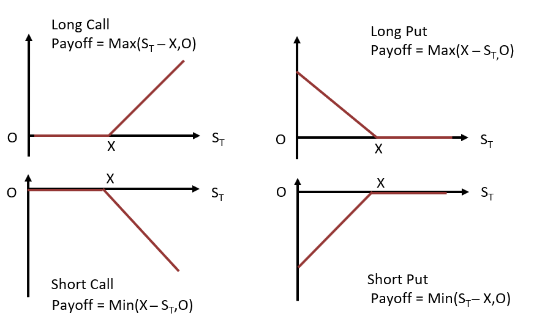

<h1>Geometry of Put-Call Parity</h1>Put-Call parity is one of the important concept in option pricing. The most intuitive way to understand put-call parity is through payoffs. 

Image adding a Long Call and Short Put at same price _C(S(T), T) + (-P(S(T), T))_. The graph shows that the _C(S(T), T) - P(S(T), T)_ is just the pay of long forward payoff (S(T) - K). 

A portfolio consisting of a long position in a call and a short position in a put has the same payoff as a long forward contract with same strike (at the expiration). From the law of one price, at any earlier time, a long call and a short put with same strike is equal in value to a forward contract. 
