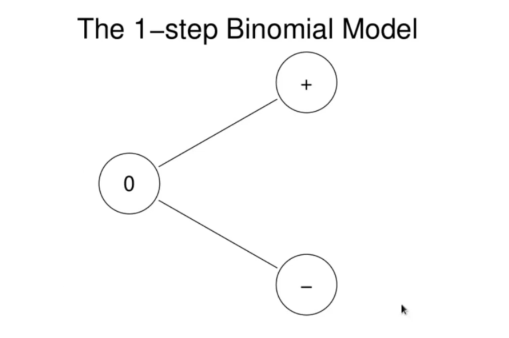
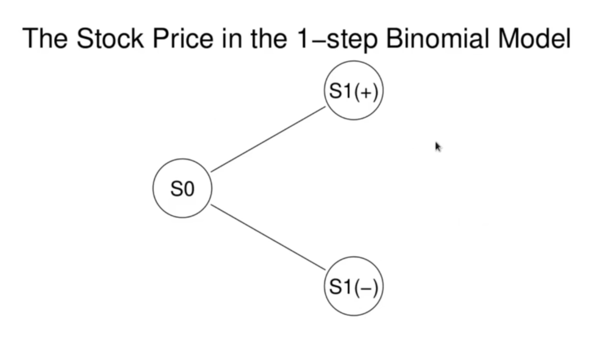
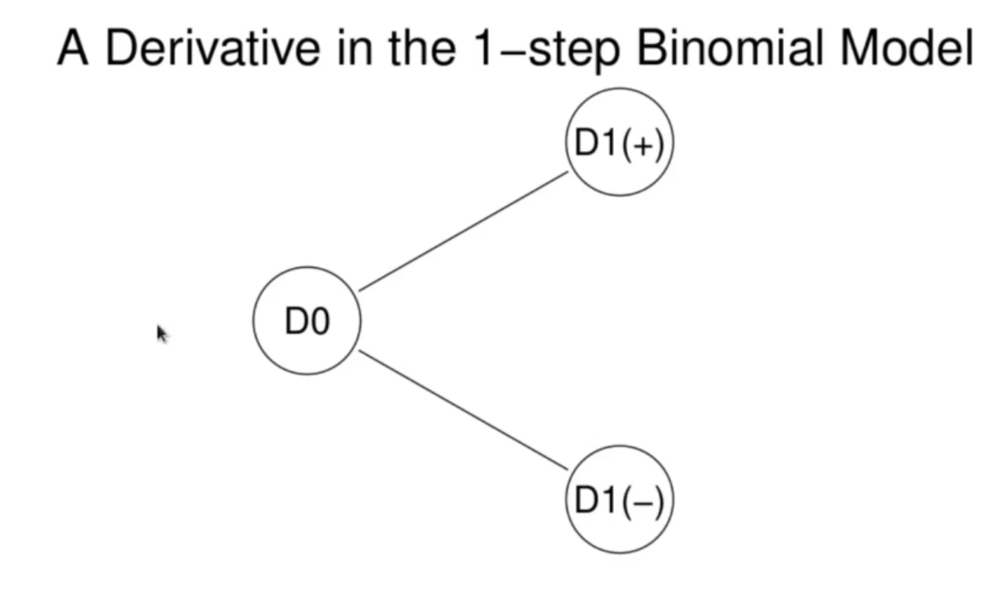
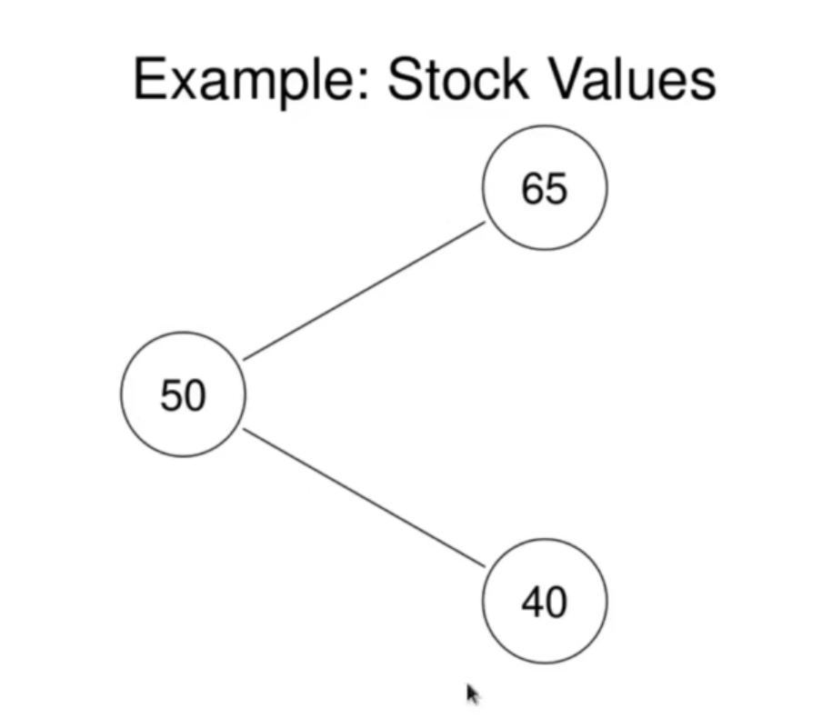
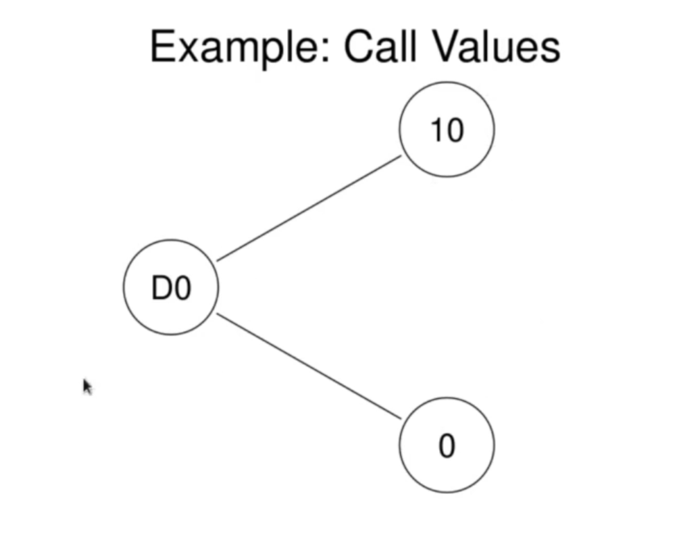
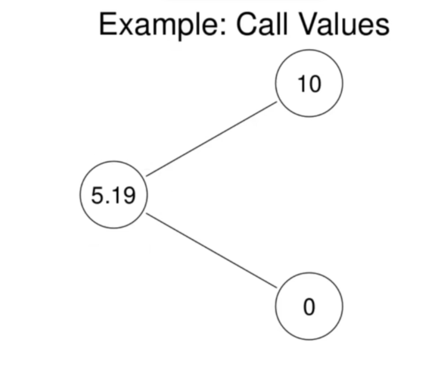

<h1>Binomial Model</h1>
Here we will look at a simple model (Binomial model) of th evolution of a stock or other asset price. Within this model, we will price options and other deivatives. The mathematical simplicity of the model allows us to focus on the core financial issues and understand them. In fact, the binomial model is much more accurate than it looks. The basic idea can be used to approximate, arbitrarily well, much more realistic models of asset price evolution. We will also deduce the Black-Scholes option pricing formula from this model. 

In the 1-step binomial model, there are only 2 times, _t=0_ when we start, and _t=1_. The unit of time is completely irrelevant. It can be assumed to be 1 min, 1 day, 1 week, 1 month or 1 year. It doesn't impact the model. We consider a stock with price  at time _t_ for _t = 0, 1_. At time _0_ the stock takes some initial value . At time _1_ we assume the stocj can only take 2 different values, denoted . We assume .

 is a random variable, taking the 2 possible values with probabilities

The "probability space" of the binomial model: there are 2 states of the workd at _t_ = 1, + and -.

We also assume there is a derivative asset, _D_, for which the stock is the underlying and which expires at time _1_. As an asset derived from the stock, the values _D_ can take at time _1_, the payoff of the derivative, are determined by the values of the stock. Thus there are 2 values  and  such that

 
  

 is the fair value of the derivative at time 0. 

, the price of the derivative at time _0_, must be determined by an arbitrage arguement. 

To carry out the arbitrage arguement to determine , we need one more asset. We assume there is a risk free investment. We assume there is a risk free investment. We assume there is a risk free interest rate _r_, whose implicit unit of time and compounding period are the time unit in the binomial model. Therefore, an investment of _K_ at the risk free interest rate at time _0_ is worth _K( 1 + r )_ at time 1 in all states of the world, that is, no matter the value of , or with probability 1.

<h3>Example</h3>
Suppose the stock has initial value 50 and at time 1 takes the value 65 with probability p >0 and the value 40 with probability 1-p > 0. Suppose the derivative is a call with strike price 55, expiring at time 1. Thus

 
   

Suppose the risk free interest rate is _r=8%_. Determine . the fair value of the call at time _0_, ie the call premium. 

<h3>Solution</h3>

We will implement an arbitrage by forming a riskless portfolio consisting of some portion of the stock and a short position in the call. Let  be the allocation of our portfolio to the stock. And our portfolio will be short 1 call. The value of the portfolio at time _t_ is thus

For this to be a riskless portfolio, it must have the same value at _t=1_ in all states of the world. Thus we must have

Substituting our known values gives

Solving for 

Therefore, the portfolio consisting of 0.4 shares of the stock and that is short 1 call option has the same value in both states of the world at time 1. We can calculate this value by evaluating  in either state of the world. It is

 
  

We thus proved 

The portfolio has the same payoff as an investment at the risk free rate whose final value if 16. Absence of arbitrage (or from the Law of One Price) forces the portfolio value at time 0 to be the discounted value of 16. In other words: 

 
   
   
   

which is the call premium. The completed binomial diagram for the call is

The arbitrage technique used here is a simple example of delta hedging, which involves hedging the option with the underlying to create a riskless portfolio.
