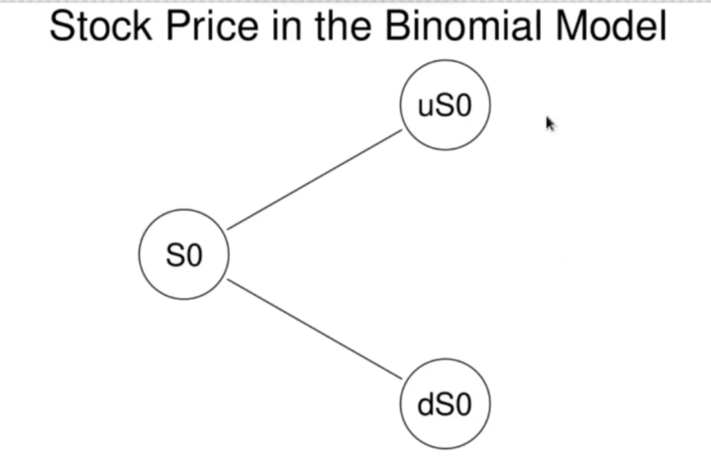

<h1>Binomial Model - General Case</h1>
Here we will generalize our arbitrage pricing technique from the previous notes for any asset. Assume we have a stock (or any asset) with value  so that at _t=0_ the stocj takes an initial value  and at time 1 the stock has may take one of the 2 values  with probabilities

Aboout the probabilities _p_ and _q_ we assume only that _0< p, q_. Let _d_, and _u_ be numbers with _0 < d < u_ such that

While not required, one may assume conceptually that _d < 1 < u_. Notice that _u_ and _d_ are the gross returns in the + and - states respectively. 

As befpre we ssume there is a risk free interest rate _r_ such that a cash investment of value _K_ at time _0_ worth _K(1+r)_ at time 1. Absence of arbitrage requires we assume

For if _1+r <= d_ than with certainty the stock returns at least as well as the risk free investment. We could create an arbitrage by borrowing at the risk free rate and spending the proceeds on the stock. If _u <= 1+r_ we construct an arbitrate by shorting the stock and investing the proceeds at the risk free rate.

As before, we also assume we have a derivative, with stock as its underlying, with values , with an initial value  and such that

 
  

 constitute the payoff of the derivative, and are assumed known.  is the fair value of the derivative at time 0 and must be determined by arbitrage. The arbitrage will be realized by delta hedging, as in the example from last time, but now for the general case.

For delta hedging, recall we form a portfolio consisting of  units of the stock and a short position in the derivative.  is chosen such that the portfolio is riskless. Let our arbitrage portfolio have value function

 is chosen so that  is the same in all states of the world at time 1 and so in not random. Thus  solves the equation

Solving this linear equation for  gives

Thus

is the same value in both states of the world. We can calculate its deterministic value by evaluating it in either state. Using the + state:

 
   
   
   

 has the same value in the - state. As  is, with probabilit 1, a constant value, by arbitrage, its value at time 0 must be the dicounted value of the value at time 1:

 
   
   

we may determine  by equating these expressions and solving for . So

 
   
   
   
   
   

This gives us the fair value of the derivative at time 0. Rewrite the expression in the following way:

This presents the fair price of the derivative as a linear combination of the discounted values it takes on expiry. Next, we will use this representation to great effect to derive a powerful method for pricing derivatives in the binomial model.
