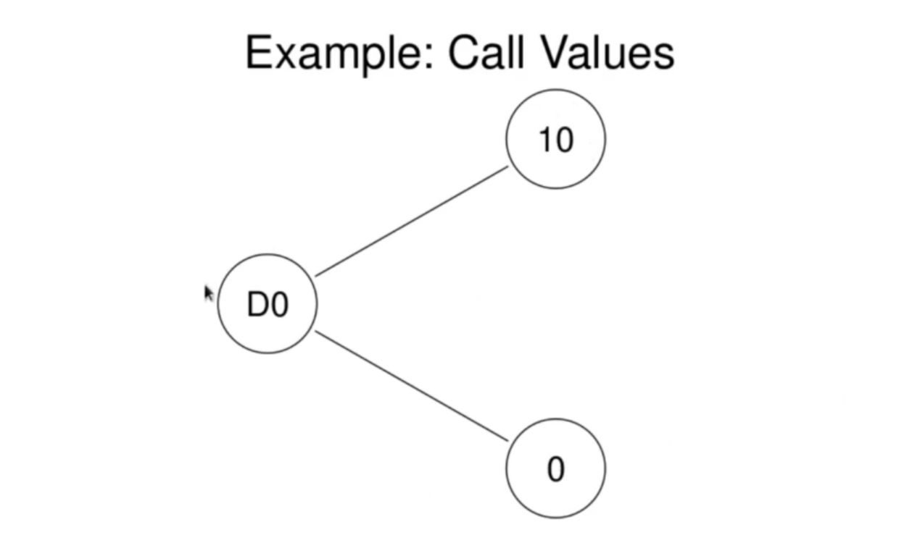

<h1>One Step Risk Neutral Pricing Example</h1>
We will consider the example of a call in a 1 step binomial model considered previously. We will analyze this problem from the point of view of the risk neutral distribution.

Recall the stock has initial value 50 and at time 1 takes the value 65 with probability _p_ > 0 and the value 40 with probability _1-p_. The values of the call option were

 
   

Recall the risk free interest rate is _r = 8% = 0.08._

We will determine  using the risk neutral distribution.

First, we must calculate the risk neutral probabilities. Recall, they are

where _u_ and _d_ are such that

 
   
   
  

Plugging our date into the expressions for the risk neutral probabilities:

 
   

From the last lecture, we know the call premium should be the expectation, in the risk neutral distribution of the discounted call payoff: 

 
   
   

confirming our previous calculation.
