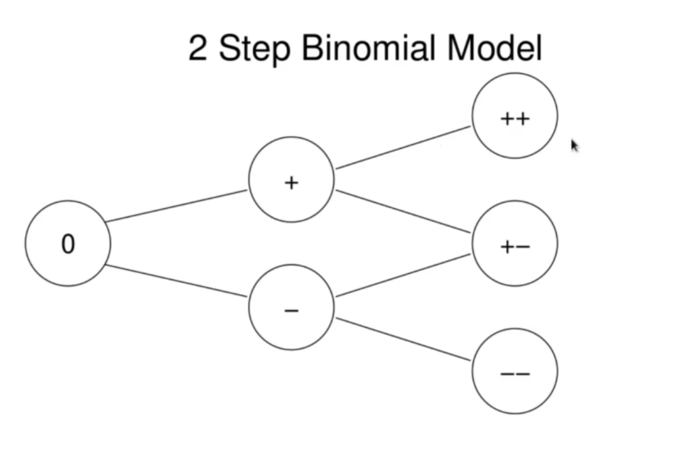
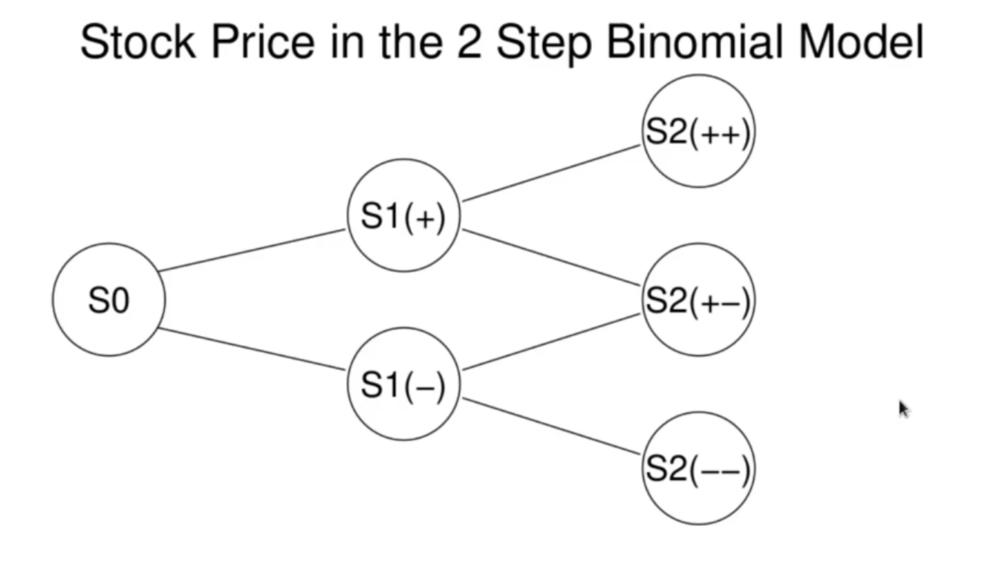
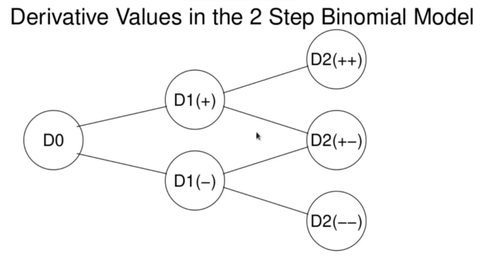
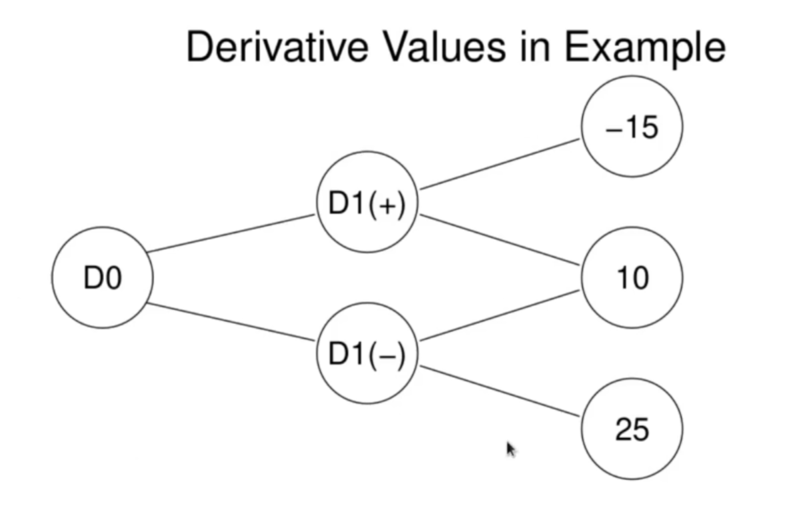
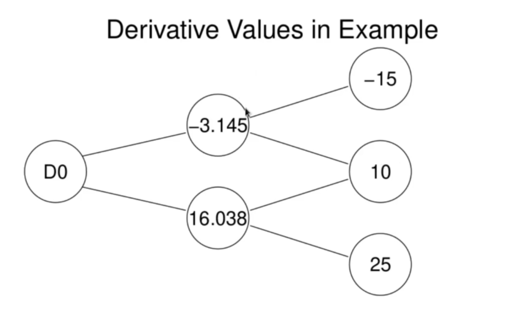
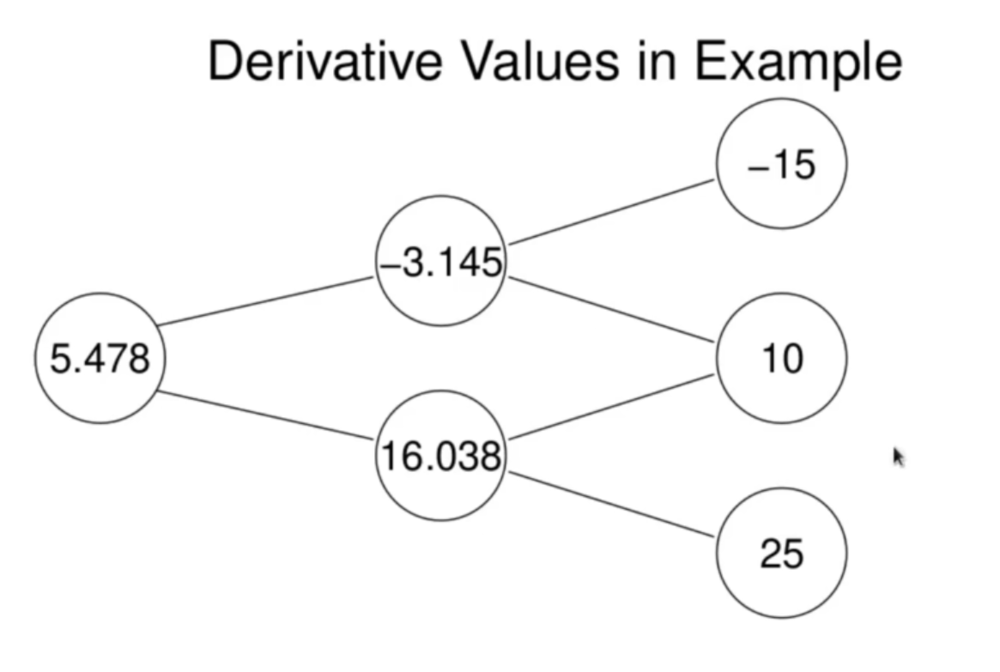

<h1>Binomial 2 Step Model</h1>
We will extend the 1 step binomal model now to 2 steps. We thus consider 3 times, _t=0, 1, and 2_. We have a probability space as depicted in the next slide. We have a stock price  defined for the 3 times.  is a given number, the initial value of the stock price, 

 is a random variable taking 2 possible values . 

 is a random variable taking 3 possible values . 

<h3>The "probability space" for the 2 step binomial model</h3>

<h3>Stock Price in 2 Step Binomial Model</h3>

Implicitly 

Extending both the model and notation from the 1 step model, we assume there are numbers _d , u_ with _d < u_ such that

 
   
   
   
   
   

We assume we have a risk free interest rate _r_ such that an initial investment of _K_ at time 0 is worth _K ( 1 + r)_ at time 1 and _K(1+r)(1+r)_ at time 2. And we assume there is a derivative asset with the stock as its underlying and expiring at time 2. The value of the derivative at time _t_ is . The values given of  are the payoff of the derivative, but the earlier values  are determined by arbitrage. 

<h3>Derivative Values in 2 Step Binomial Model</h3>

 bears the same relationship to its descendents  as  does to its descendents, and similarly for .

In particular, to calculate the arbitrage value of  we discount  and then take the risk neutral expectation. 

Similarly  is the risk neutral expectation of the discounted values of . 

Finally to calculate  we take the risk neutral expectation of  after discounting them. 

Because of the relationship between the stock price values and their descendents in the binomial model ( ir the same _u_ and _d_ is used at each step) the risk neutral probabilities are the same for each step. This outlines a "backpropagation algorithm" for pricing derivatives in the 2 step model.

<h3>Example</h3>
Consider a 2 step binomial model for a stock with u = 1.2 and d= 0.9. Suppose the risk free interest rate is 6%. Suppose there is a derivative, with the stock as its underlying, and expiring at time 2, with a payoff given by .  Compute the fair price of this derivative at time 0.

The values at time 2 represent the known payoff. All other values must be determined by arbitrage. To compute arbitrage price for the derivative, we will use risk neutral expectations, and so we need the risk neutral probabilities. Recall the risk neutral probabilities are:

We compute these using our given data: _u =1.2, d=0.9, r=6% = 0.06_.

 
  

Now we compute risk neutral expectations and arbitrage prices for the derivative. 

 
   
   
   

Now, given the values we have computed for  we can carry out the final step of computing , once again, using the risk neutral expectation. We have

 
   

So we have calculated the fair price of our derivative. We plot the final version of our binomial diagram:

