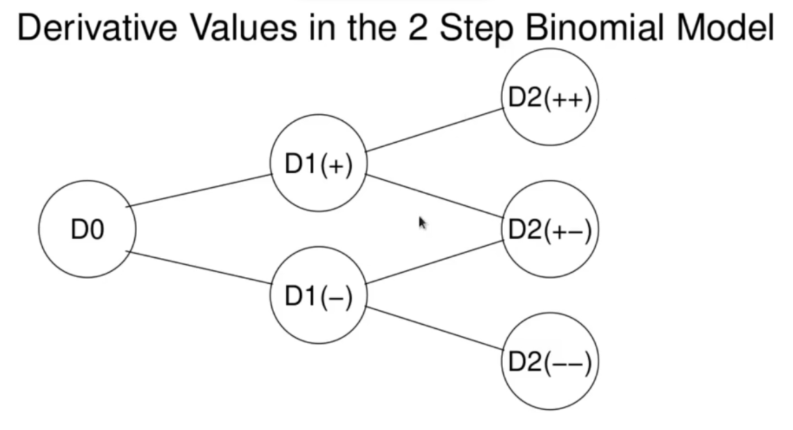
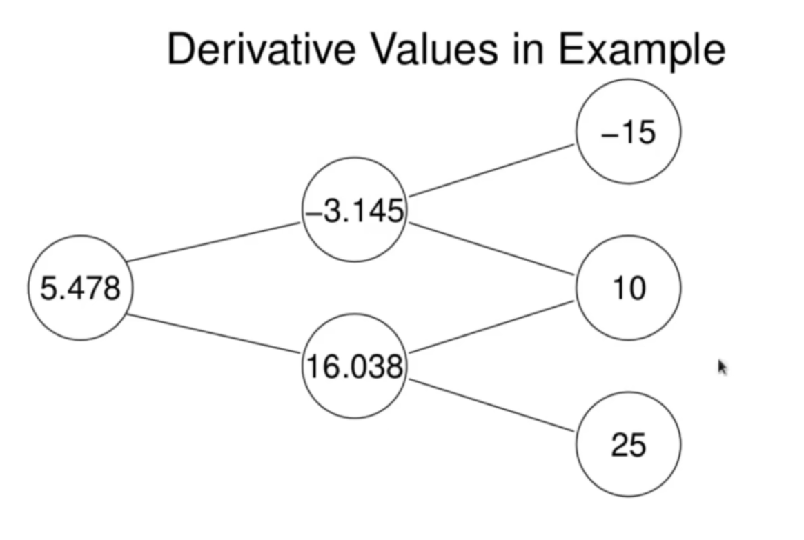

<h1>Distribution in the 2 Step Binomial Model</h1>
Here, we will calculate the risk neutral probability distribution for the asset price  at time 2 in the 2 step binomial model. 

In doing so, we will also express the arbitrage price of any derivative contingent on the asset as a risk neutral expectation.

We use risk neutral expecations to express  and  in terms of the values of .

Let  be the risk neutral probabilities. Then

 
  

where _r_ is the risk free rate. Now we express  as a risk neutral expectation of the values of  and expand:

 
   
   

Recall the binomial distribution from our random walk study. These are the binomial probabilities  

This represents the derivative price  as a binomial expectation of its discounted payoff values:

<h3>Example</h3>
We will apply the previous formula to the derivative pricing problem from the last notes. The final result is displayed in a 2-step binomial diagram here:

We will solve this problem using the risk neutral expectation formula we have derived here. Recall the data from this problem . We will calculate the derivative price at time 0 from the risk neutral expectation

Explictly:

 
  

Thus our previous answer (and the risk neutral expectation formula) is confirmed. 
