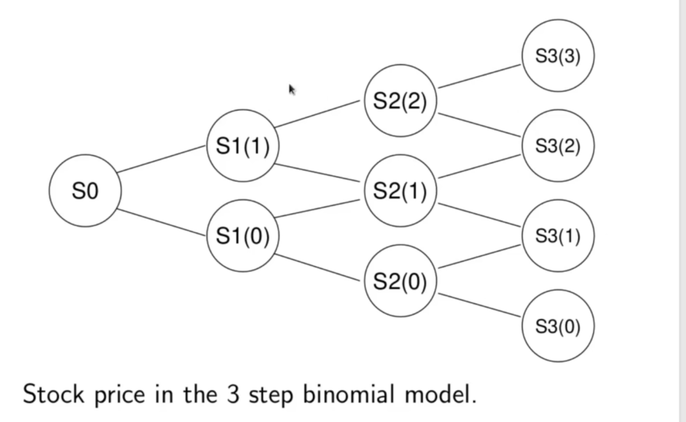

<h1>Full Binomial Model</h1>
Now we will consider the full binomial model for an arbitary number _(n)_ of steps. We will start, though, by extending our treatment for 1 and 2 steps to the 3 step binomial model. The work we have done up to the 2 step model extends in the natural way. Consider the general case of the stock price on the 3 step binomial model, as illustrated in the following binomial plot.

At the 3rd timestep we have 4 states of the world corresponding to the values for the stock:

 
   
   
  

Correspondingly, a derivative expiring at the last time step can be specified at the last time step by its payoff:

 
   
   
  

With the same procedure as in the 2 step case the fair value of the derivative at time 0, , can be computed:

 
 
  

We may continue extending the number of steps. The basic results extend in the natural way. The notation we have used so far is unwieldy for a large number of steps, and so introduce a modified notation now. 

We preserve our notation using the "up" and "down" factors _u_ and _d_. Thus, we continue to model the forward evolution of the stock price one time step by multiplying by either _u_ or _d_. We now use the below notation for the underlying asset price.

The index _j_ equals the number of up jumps the stock has taken up to time _k_. The order the up and down jumps were taken in is immaterual. There are many paths that could be followed for the stock price to reach 

As long as the total number up jumps is _j_, this same level will be realized at time _k_. A contingent derivative asset can be specified in this notation as well, with

the value the derivative takes in the state of the world at time _k_ when .

The payoff of the derivative is then specified by its values at the endtime _n_:

Following the same essential chain of logic that established the time 0 price of the derivative for the 1, 2 and 3 step cases, we can show

 
  

