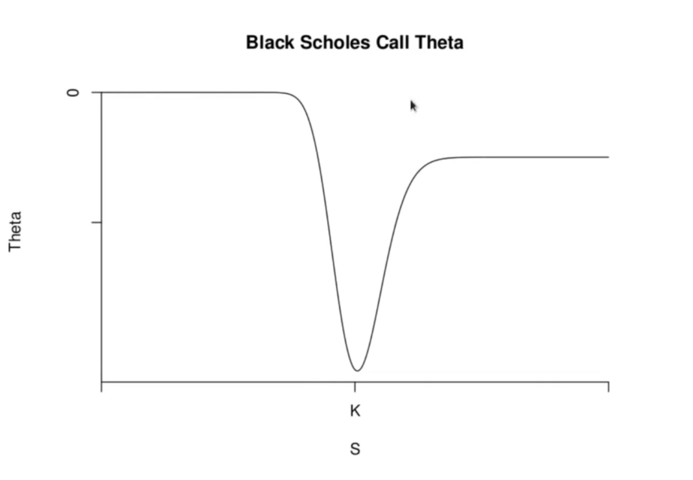
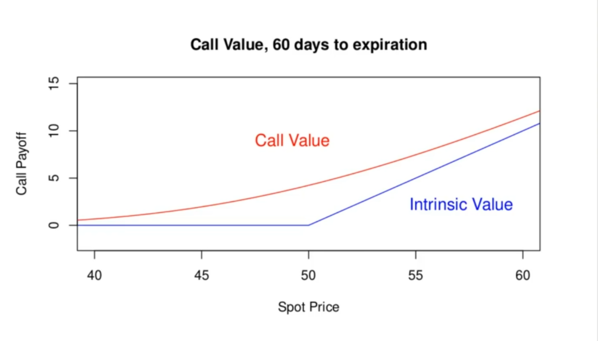
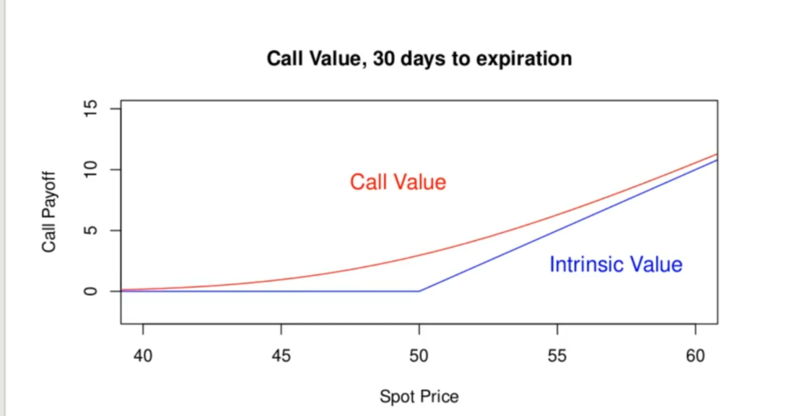
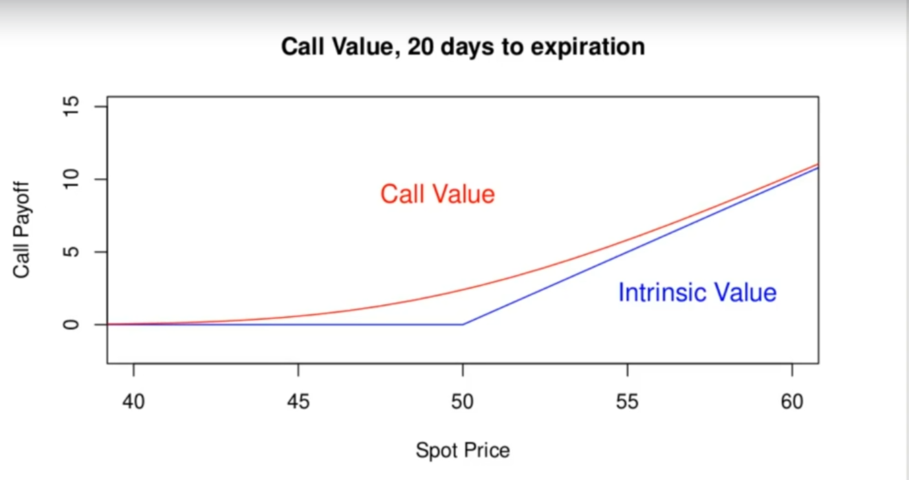
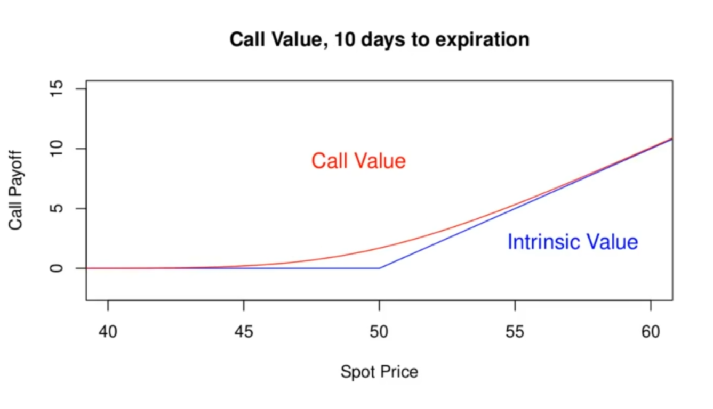
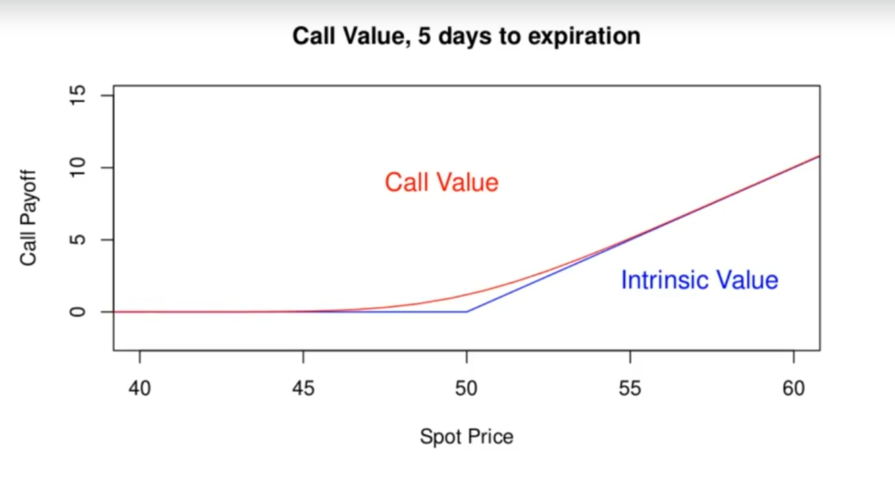
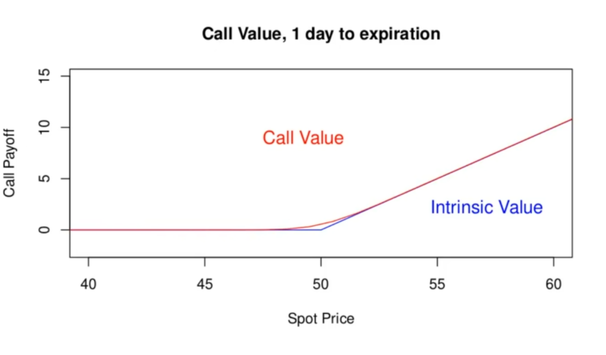

<h1>Option Theta and Time Decay</h1>
The theta of an option is the time derivative of the option value. It is usually considered one of the greeks, because it is a derivative of the option price:

It is different from other greeks because it does not measure the sensitivity of the option value to a risk factor. It measures the time decay of the option value. As the expiration date of a call or put (usually) is approached, the value of the option decreases. That's why this phenomenon is referred to as "time decay". For a call, from the Black-Scholes formula

We note that . The fair value of a call option will, if all market factors remain constant, decrease in time as the expiration date approaches. Just holding an option (in the absence of any favorable market moves) is a losing strategy.

The theta for a put is

This is also negative, except for very in the money puts.

<h3>Black-Scholes Call Option Theta</h3>

As observed theta is most negative for at the money call option. It decreases in magnitude for both out of money and far in the money options. Time decay is fastest for at the money options. For call option thats out of money, time decay is almost zero. 

Why does the option value decrease as the expiration date approach?

The closer an option holder is to the expiration date, the less likely it is that the underlying price will end up at an even more favorable level, resulting in even better payoff. It is more likely for the underlying price to end up at an unfavorable level at expiration as well. But due to the asymmetry of options, ie the worst thing that can happen is the option expires worthless, the potential benefits outweight the potential losses. 

<h3>Example</h3>
Suppose I own 50 calls, expiring in 2 months on a stock currently trading at $30 with a strike price of $25, priced with a volatility of 35%. Suppose the risk free rate is 4%, How much can I expect the option value to lose over the next month, absent any other changes in market factors? Answer this 2 ways: (a) by calculating the theta and scaling it to 1 month, (b) by repricing the option. 

Collecting togehter our data we have:
<li>Spot Price = S = $30</li>
<li>Strike Price = K = $25</li>
<li>Time to Expiry = T = 2 months = 2/12 years.</li>
<li>Volatility = Sigma = 35% = 0.35</li>
<li>Risk Free Rate = r = 4% = 0.04</li>

To compute 

 
  

and

 
  

We thus have a theta of

 
  

To use this to approximate the loss on an option in 1 month (or any time duration) remember that theta is a the derivative

