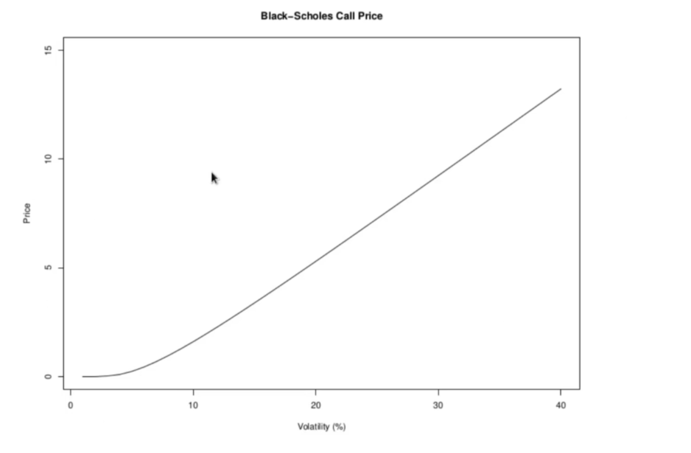

<h1>Options and Volatility Trading</h1>

Both the call price and the put price are increasing funciton of the volatility parameter 

As a consequence of this, trading and dealing in options is equivalent to trading volatility. In fact, a long position in options is equivalent to being lng volatility, in the sense that an investor long options will profit if volatility increases. Equivalently, being short in options implies short volatility, that is, an investor loses if volatility increases. So options are vehicles for taking a position in volatility. If an investor thinks volatility is going to rise, she can buy options to profit from this expectation. If she expects volatility to decline, she can sell options to express this view. 

A "long volatility trade" normally refers to a long option position where the investor wants long exposure to volatility only. To achieve this, the investor must protect the position from the risk of the underlying price. The standard way to implement a long volatility position is to buy options, but dynamically delta hedge the position so that the total position is delta neutral. The procedure is best explained with an example:

<h3>Example</h3>
Suppose we have a stock currently trading at $100. Suppose 1 year at the money call options are currently priced with a volatility of 10%. Suppose the risk free interest rate is 5%. Suppose we have a forecast that the volatility of this stock wil increase over the next 6 months, but we have no view on the stock price itself (it may go up or down). How do we implement an option position on 1000 shares to profit from our forecast? Now suppose in 6 months the volatility of the stock has increased to 40%, and consider 3 different scenarios for the stock price in 6 months: $90, $100 and $110. Check the P&L for the position in each case. For simplicity assume we did not change the delta hedge.

To profit from our forecast, we set up a long option position, and delta hedge it.

Our initial data at the outset:
<li>spot price = S= $100</li>
<li>strike price = K = $100</li>
<li>time until expiration = T = 1 year = 1</li>
<li>volatility = 10% = 0.1</li>
<li>interest rate = r= 5% = 0.05</li>

The option price, from the Black-Scholes formula:

 
  

and 

 
  

Substituting into the Black-Scholes formula then gives the call price (for 1 share):

 
  

To determine the hedge, we need the delta:

So our delta hedged position will consist of 1000 call options and a short on 709 shares. We suppose we hold this position for 6 months, with no further trading activity.  We consider each of the 3 proposed proposed scenarios 6 months laet.

__Case 1:__ stock price = $100. The stock position has deteriorated by $10 per share. We have lost $7090 total from the stock position. To compute the P&L on the option position, we revalue the option using the updated volatility of 40% as well as the updated stock value of $110. We recompute the call value from the Black-Scholes formula:

  

and 

  

Substituting into the Black-Scholes formula then gives the call price (for 1 share):

  

The final P&L on the position after 6 months is 1000 * (18.94 - 6.80) - 7090 = 5050 profit.

__Case 2:__ stock price=$90. First note that the short stock position has now gained $10 per share, so on the stock we have profited by $7090. To evaluate the Black-Scholes formula we need:

  

and 

  

Substituting into the Black-Scholes formula then gives the call price (for 1 share):

  

The final P&L on the position after 6 months is 1000 * (7.20 - 6.80) + 7090 = 7490 profit.

__Case 3:__ stock price=$100. Now the stock position has broklen even, so all the P&L is from the change in option position. To evaluate the Black-Scholes formula we need:

  

and 

  

Substituting into the Black-Scholes formula then gives the call price (for 1 share):

  

The final P&L on the position after 6 months is 1000 * (12.39 - 6.80)  = 5590 profit.

We have profited in all cases, by amounts that do not diverge that much. The delta hedge protects the position from adverse moves in the stock price, so the profit is primarily from the increase in volatility.
