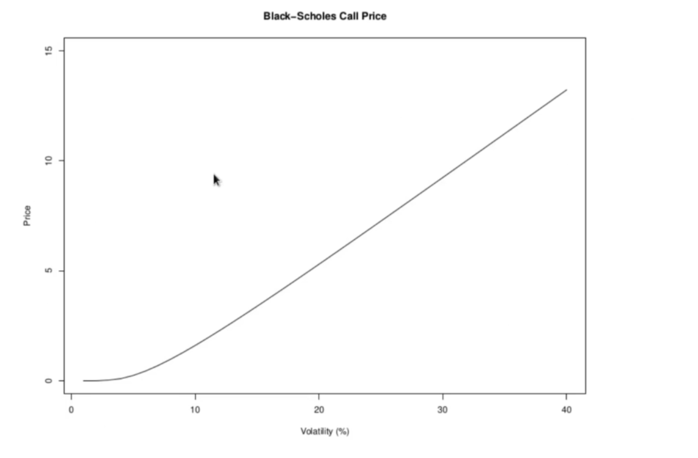

<h1>Implied Volatility</h1>

The Black-Scholes call price is a one to one function of the underlying volatility. As a consequence, for any price for an option there is a unique value for the volatility (assuming all other parameters are fixed) such that the Black-Scholes formula yields that price. Therefore, if a particular price _c_ is observed on the market for a particular call option, then there is a unique volatility value  that can be substituted into the Black-Scholes formula to yield the price _c_:

 is called the Black-Scholes __implied volatility__, but except in the rare case that some other model is used to find it, it is simply the implied volatility. For vanilla options, ie standard calls and puts, prices are not determined by the Black-Scholes theory. They are negotiated on options markets and are the outcome of supply and demand forces. But where the Black-Scholes theory does come into the picture is when observed market prices are translated into implied volatilities by way of the Black-Scholes formula. Quoting prices as Black-Scholes implied volatilities provides a universal and standardized language for communicating option prices, and this is the standard market practice. 

<h3>Volatility Surfaces</h3>

When implied volatilities are computed for different options on the same underlying, they are found to be functions of the strike price and the expiration date. This is inconsistent with the Black-Scholes theory for which there can only be one volatility for a given underlying asset. This leads to the notion of a volatility surface, the graph of the function  the implied volatility as a function of the strike and the expiration. When one looks at the implied volatility as a function of strike for a fixed expiration, it is usually in the shape of a smile or a skew. 

The investor is pricing deep out of money or in the money call/put options at higher volatility than the Blakc-Scholes function compared to strike price.

Plotting the volatility smile, sjew or surface is the market convention for representing the option market. Practioners looking at a volatility surface can understand intuitively what the state of the options market is. The implied volatility for a particula option says that the market is pricing that option as if futre volatility for the asset will be the computed implied volatility. If a trader has views on what the future volatility is likely, then he can compare his forecast with the implied volatility, and decide if the market is mispricing the option. 

Another way implied volatility is used is to use it as the volatility parameter in the greeks.
